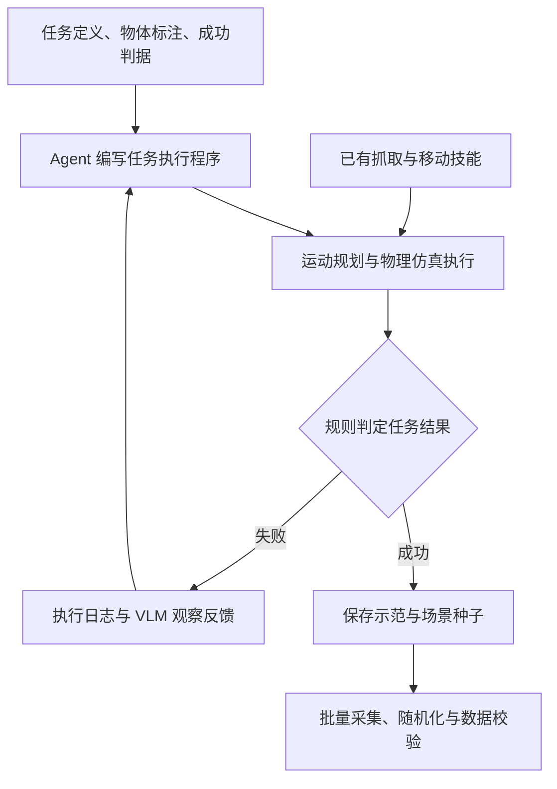

# RM65-B 灵巧手仿真数据采集：RoboTwin 2.0 自动生成路线

> [!abstract] 核心判断
> 可以复刻 RoboTwin 2.0 的自动合成示范框架。当前优先工作是补齐 RM65-B＋因时四代灵巧手的抓取技能、运动规划和记录语义，再引入 Agent 扩展任务。首个里程碑应是一个可稳定执行、可回放、可训练并经独立场景检验的数据闭环。
> 本文按“先在仿真采集，再研究真机迁移”设计；没有执行新采集、策略训练或真机控制。

## 本次问题与证据边界

问题：机器人已接入 RoboTwin，能否采用官方 VLM／MLLM Agent 流程自动生成示范？哪些内容可以复用，哪些需要为双臂灵巧手重新设计？

- **官方方法与指标**：2026-09-24 核查官方文档及论文 arXiv `2506.18088v2`；属于作者报告，未在本项目独立复现。
- **本地实现状态**：本机 `/home/admin123/liminghe/vla-benchmark/RoboTwin`，commit `c826f28d3bb499d7bb8e5afe94236a5b26d49b2f`，本次归档时复核 HEAD 与工作区。下文状态不代表 SSH166 已同步或已通过同样验证。
- **项目设计建议**：下文技能设计、记录字段、实施阶段与验收方式属于拟议方案，不能记作已完成能力。
- **硬件边界**：讨论当前接入的双 RM65-B（每臂 6 轴）与因时四代手资产，不沿用 S02、七轴臂或二指夹爪的动作假设。厂家资料接入不等于实机标定完成。

## RoboTwin 实际如何生成数据

“50 个任务的数据完全由 VLM 自主生成”不够准确。官方实现中，Agent 主要生成 `play_once()` 任务执行程序；`setup_demo()`、`load_actors()` 和 `check_success()` 仍由开发者提供。程序调用已有操作技能，依靠运动规划与物理仿真产生轨迹。生成失败后，可结合执行日志和视觉观察修复程序。[官方代码生成文档](https://robotwin-platform.github.io/doc/usage/expert-code-gen.html)

本地采集代码先尝试场景种子，检查规划和任务成功并保存路径；随后在采集阶段读取种子与路径、执行任务并导出数据。任务程序生成与批量录制是两个环节，不能把每条轨迹都理解为由大模型直接逐帧输出关节值。[当前采集实现](https://github.com/Minghe111/RoboTwin-RealMan/blob/c826f28d3bb499d7bb8e5afe94236a5b26d49b2f/scripts/collect_data.py#L154)

论文 v2 的自动生成程序执行平均成功率，在 10 个任务的对比实验中为 **71.3%**，全部 50 个任务的结果表为 **43.34%**。这两个数字的任务范围不同；它们不是发布数据的合格率，也不是训练后 VLA 策略的成功率，不能据此认定所有任务均已实现稳定自主生成。[论文 §4.1、附录 G.3](https://arxiv.org/html/2506.18088v2)

**对项目的含义**：已有官方任务可以优先复用程序与场景，无需先让 Agent 重写全部任务。Agent 能有效组合技能的前提，是对应技能在本体上已经可执行。

## 当前 RM65-B 接入到了哪一步

| 项目 | 当前状态 | 对采集的意义 |
| --- | --- | --- |
| 模型与加载 | 通过标准 embodiment 配置加载当前 RM65-B＋四代手资产 | 可以复用 RoboTwin 的模型管理入口 |
| 原生动作 | 24 维：左臂 6、左手 6、右臂 6、右手 6 | 手指联动关节不作为独立动作通道 |
| 单位 | 臂为弧度；手为 SDK 编码归一化的 0..1 | 手通道不是弧度，不能直接套旧 14 维夹爪策略 |
| 规划模式 | `planner: joint_space` | 支持当前关节控制；未完成笛卡尔专家抓取规划 |
| 专家采集 | `expert_collection: false`，采集入口主动拒绝 | 不能仅打开开关就声称能够采集专家数据 |
| 末端参考系 | 厂家手安装坐标系 | 不是已经标定的抓取 TCP／指尖参考系 |
| 相机 | 当前为外部检查视角，腕部外参待补齐 | 不能称为真机三视角相机已完成匹配 |
| 数据接口 | 已有原生观测及 HDF5 通道 | 通道与维度通过检查不等于动作标签语义正确 |

依据：[当前模型配置](https://github.com/Minghe111/RoboTwin-RealMan/blob/c826f28d3bb499d7bb8e5afe94236a5b26d49b2f/assets/embodiments/realman-rm65b-inspire-gen4/config.yml)、[采集限制](https://github.com/Minghe111/RoboTwin-RealMan/blob/c826f28d3bb499d7bb8e5afe94236a5b26d49b2f/scripts/collect_data.py#L113)、[接入说明](https://github.com/Minghe111/RoboTwin-RealMan/blob/c826f28d3bb499d7bb8e5afe94236a5b26d49b2f/integrations/realman_rm65b_gen4/README.md)。私有仓库链接需登录对应 GitHub 账号。

## 主要难点与可复用部分

| 环节 | 可复用内容 | 本项目需要补齐 | 优先级 |
| --- | --- | --- | --- |
| 场景与任务 | 官方任务定义、物体资产和语言描述 | 验证桌高、对象摆放、目标姿态是否适合 RM65-B 工作空间 | 高 |
| 灵巧手抓取 | 接近、抓取、搬运、放置的任务结构 | 预抓手型、拇指姿态、闭合顺序、稳定夹持和释放 | 最高 |
| 双臂规划 | RoboTwin 规划接口与候选姿态思路 | 抓取参考系、逆运动学、躯干与双臂及手指碰撞模型 | 最高 |
| 接触物理 | 引擎与物体动力学基础 | 摩擦、驱动、联动、负载和接触稳定性检验 | 高 |
| 录制与转换 | 原生缓存、HDF5、录像输出 | 指令和状态分离、时间对齐、回放验证 | 最高 |
| 视觉与真机迁移 | 相机与随机化框架 | 实际视角、内外参、时延及控制映射校准 | 高，真机迁移前必须处理 |
| Agent | 代码生成、执行反馈、视觉观察模块 | 更新为灵巧手技能 API、示例和可定位的失败信息 | 基础技能稳定后接入 |

### 灵巧手不能只替换夹爪开合量

二指夹爪用一个开合值控制夹持；当前每只手有六个独立控制通道。物体原有抓取点可以作为候选位置，但不能自动决定掌心相对位姿、拇指对掌角度和多指接触方式。

以瓶子为例，直接让所有手指同时闭合，可能把物体推倒。拟议技能应考虑“预抓手型→接近→分阶段闭合→抬起→保持检查”。先建立少量可靠的包络抓取、捏取和释放技能，再扩展对象与任务。上层技能可以参数化，底层仍保留六通道手控制。

原机器人关节轨迹不能直接回放到 RM65-B。可以复用任务意图和物体关系，需要重新求解本体动作。若为可达性修改任务目标、场景分布或成功条件，应记录为 RM65-B 适配协议；其分数不能直接当作官方榜单同协议成绩。

### 物理合理性与真机一致性是两个验收层次

仿真阶段先排查穿透、异常碰撞过滤、物体被挤飞及短暂悬空造成的假成功；真机迁移还要验证手部编码、控制时延、负载与接触参数。当前 SDK 编码到关节弧度采用端点线性映射，未完成实测标定；力阈值未转换为仿真关节力矩。

当前 `sensor_contact_load_proxy_N` 是由接触冲量得到的诊断量，不是真实触觉阵列或标定压力值。它可作为仿真调试信息，不能未经建模和验证就用作真实触觉监督标签。[实现边界](https://github.com/Minghe111/RoboTwin-RealMan/blob/c826f28d3bb499d7bb8e5afe94236a5b26d49b2f/integrations/realman_rm65b_gen4/README.md)

## 录制设计：必须区分实际状态与动作目标

> [!important] 本次核查发现的具体问题
> 当前转换器使用 `state = values[:-1]`、`action = values[1:]` 构造监督对。灵巧手分支的 `joint_action` 来源实际是测量状态，因此保存为动作的数值会是“下一帧实际位置”，不能自动解释为“当时下发的目标位置”。有接触阻挡、速度限制或控制滞后时，二者尤其不同。

代码依据：[HDF5 配对逻辑](https://github.com/Minghe111/RoboTwin-RealMan/blob/c826f28d3bb499d7bb8e5afe94236a5b26d49b2f/envs/utils/pkl2hdf5.py#L103)、[机器人观测分支](https://github.com/Minghe111/RoboTwin-RealMan/blob/c826f28d3bb499d7bb8e5afe94236a5b26d49b2f/envs/robot/robot.py#L543)、[测量状态与目标控制器](https://github.com/Minghe111/RoboTwin-RealMan/blob/c826f28d3bb499d7bb8e5afe94236a5b26d49b2f/envs/robot/realman_rm65b/controller.py#L97)。

下一状态也可以被明确设计为学习目标，但需要匹配相应执行器和回放检验。不能在没有声明和验证的情况下，把它与原始控制指令混用。已有数据维度检查不证明这一语义问题已解决。

建议保存下列信息；这是待实现的数据约定，不代表当前文件已经具备全部字段：

| 信息 | 建议语义 |
| --- | --- |
| 观测 | 动作开始前的图像与实际关节状态；各自的采样时间 |
| 请求动作 | 高层在当前控制周期请求的 24 维目标 |
| 执行目标 | 控制器变换或限速后实际施加的目标；必要时保留周期内子步序列 |
| 时间 | 仿真时间、控制步号、动作起止时间和持续时长 |
| 任务标注 | 语言、技能阶段、使用的手臂、阶段与最终成功标记 |
| 可追溯信息 | 场景种子、物体实例、机器人和控制器版本、配置版本 |
| 接触诊断 | 仿真接触量独立命名，明确与真实触觉的区别 |

先确定策略预测的是原始目标、处理后目标还是下一状态，再确定监督标签和推理执行方式。物理步频、策略频率、图像保存频率与网页播放帧率分别记录，通过时间戳验证，不从配置字段或视频帧率推断一致性。

## 分阶段实施与验收建议

以下阶段是拟议顺序；试验规模和阈值需在首次试验前固定，不在结果出来后调整。

| 阶段 | 工作内容 | 进入下一阶段前的验收 |
| --- | --- | --- |
| 1. 单个抓取技能 | 固定瓶子或方块；用人工调试关键姿态或少量遥操作示范完成接近、抓取、抬起、保持、放下 | 多次重置后可重复完成；视频和接触检查证明稳定夹持，无异常穿透；记录失败原因 |
| 2. 记录与回放 | 建立少量手型；分开保存测量状态、请求目标和执行目标 | 从保存动作重放整段操作；核对时序、单位、通道和录像；说明允许的回放误差 |
| 3. 少量官方任务 | 单臂搬放、`pick_dual_bottles`；稳定后再做双臂交接 | 在预先固定的独立种子上统计整任务成功率、规划失败和抓取失败，不只展示成功案例 |
| 4. Agent 与规模化 | 给 Agent 提供经过验证的技能，生成或修复任务程序；逐步增加对象与场景随机化 | 程序成功率和每条合格示范成本可追溯；导出后复核任务结果；保存失败日志 |
| 5. 数据训练验证 | 用首批数据训练小规模模仿学习基线，重新加载模型并闭环执行 | 独立场景下有任务执行证据、视频与失败分类；不能以 loss 下降或能输出动作代替验收 |

阶段 5 可以在阶段 4 大规模采集前先用小样本试跑，及早发现数据表示和执行接口问题。建议先证明小规模数据有效，再投入大规模随机化。

训练集可以筛选成功示范，但需保留总尝试次数、失败分布及原始采样范围。评测不能只抽取专家筛选出的容易种子；训练与评测的场景、对象和语言划分应可追溯。成功判据由独立、固定的任务逻辑提供，Agent 修复执行程序时不应同时改变判据。

## 对 VLA＋RL、语言约束研究的影响

- **模仿学习基线**：先验证示范是否足以训练出稳定闭环行为，再扩大模型或数据量。
- **RL**：在任务奖励、接触物理和动作语义经过检查后，再研究抓取微调、失败恢复或约束优化；本次没有完成 RL 环境验收。
- **语言约束**：同步记录执行手臂、对象、顺序和禁止接触对象。同场景改变“只许左手”“先 A 后 B”等指令时，示范轨迹也应相应变化。
- **语言改写的边界**：给同一条轨迹生成同义句可增加表达多样性；它不能替代具有不同约束行为的示范。
- **结果报告**：分别统计任务完成率、约束违背率、阶段失败和干预情况；不能只报总成功率。

## 证据与来源

| 结论 | 来源 | 核查日期 | 证据类型 |
| --- | --- | --- | --- |
| Agent 主要生成任务执行函数，其他基础方法需开发者提供 | [官方 Expert Code Gen 文档](https://robotwin-platform.github.io/doc/usage/expert-code-gen.html) | 2026-09-24 | 官方实现说明 |
| 程序生成与视觉反馈机制、71.3%／43.34% 的实验范围 | [论文 v2 §4.1、附录 G.3](https://arxiv.org/html/2506.18088v2) | 2026-09-24 | 作者报告，未独立复现 |
| 当前模型、动作单位、专家采集与相机限制 | 本文固定 commit 的模型配置、采集入口和接入 README | 2026-09-24 | 本地静态代码核查 |
| 测量状态与下一帧动作标签的潜在语义错配 | 本文固定 commit 的 `robot.py`、`controller.py`、`pkl2hdf5.py` | 2026-09-24 | 本地代码分析，待回放试验验证影响 |
| 技能库、录制字段、分阶段验收与语言约束标签 | 本次项目设计讨论 | 2026-09-24 | 设计建议，待实施 |

## 下一步

- [ ] 明确首个对象和任务、桌面布局与固定底盘条件。
- [ ] 定义包络抓取／捏取的参考系、预抓手型及稳定保持判据。
- [ ] 补齐 RM65-B 逆运动学、双臂与灵巧手碰撞规划配置。
- [ ] 修订记录约定，分离实际状态、请求指令和执行目标。
- [ ] 验证第一个完整示范的录制与回放。
- [ ] 固定独立评测种子和失败分类，再小规模训练验证。
- [ ] 基础技能可靠后接入 Agent，评估合格示范产出效率。
- [ ] 真机迁移前单独验证相机、手部映射、控制时延与接触参数。

## 关联笔记

- [[RoboTwin 2.0框架与默认任务]]：官方默认本体、任务与数据格式的历史快照。
- [[RM65-B双灵巧手：LingBot-VLA2选型与适配路线]]：模型选型及早期适配假设；当前仿真状态以本文固定版本为准。
- [[RM65-B双臂机器人]]：硬件资源卡，真机核验状态单独维护。
- [[RoboTwin与LingBot-VLA默认流程对照]]：策略训练与仿真执行的接口边界。
- [[VLA榜单与评测基准导航]]：不同榜单的任务与协议比较。
- [[笔记库使用指南]]：笔记归档与证据管理约定。
