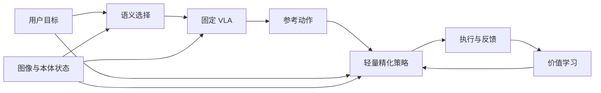

# SARL 启发的 VLA 强化学习选题：目标绑定与空间精化

> [!abstract] 本次判断
> 用户希望从 SARL 出发，比较语义→动作＋动作→动作、视觉空间→动作、多模态推理→动作，并优先选择机制干净、实现简单且有研究新意的方向。建议把宽泛的“对齐”收窄为：**语义目标保持下的空间精化，及对象/目标选择与执行误差的信用分配。** 初版固定高层与 VLA，只训练一个轻量动作修正器；同时学习语义选择与低层控制作为后续扩展。此为研究建议，尚不构成已经成立的新算法或创新证明。

> [!important] 2026-10-10 后续具体化：必要性与新颖性均未成立
> 用户要求明确状态、动作、反馈、更新及 RL 是否适用后，进一步核查见 [[目标语义保持空间精化-RL算法定义与RoboTwin最小验证]]。当前公式落在标准目标条件约束残差 RL；新查 TEMPO 与 PF-RL 分别覆盖双层语义/动作优化及目标价值几何/进度信用的部分思路。先用 RoboTwin 验证 RL 比控制器/同数据 SFT 更合适，再判断是否存在普通目标条件 RL 的具体失效。此方向目前只适合先导实验，不应作为已成立的硕士算法创新。下文保留上一轮候选判断的历史语境。

关联：[[化学实验室VLA开题-动态规程与语言强化学习]]、[[LingBot-VLA后续研究方向与四卡调试预算]]、[[VLA技术路线综述-从动作生成到世界模型与具身系统]]、[[RM65-B双臂机器人]]、[[VLA基座选择-InternVLA-A1.5、π0.5与GR00T N1.7]]。

## 1. 先校准 SARL 的启发

本次所指为 **Adapting Generalist Robot Policies with Semantic Reinforcement Learning**，arXiv:2606.31958v1。SARL 把输入 VLA 的语言提示当成语义动作，训练外部 $Q_{\mathrm{sem}}(s,\ell)$，根据环境反馈选择有效命令；原 VLA 用于将命令转成实际动作。它不是直接用 RL 微调 VLA 内部语义 token 的对齐损失。[正文 §4](https://arxiv.org/html/2606.31958v1)。

论文附录 A.1 的默认优化包含有限提示缓存与 one-hot 编码；其 Discussion 也提出语义空间与动作空间优化结合的可能性。作者示例可以用空间移动命令绕过无法正确识别的物体名称。因此，**任务成功、提示能诱发有效行为、原指令语义保持、内部表示对齐**是不同主张，不能仅由 SR 同时证明。

启发应表述为：**RL 的决策变量可以是模型的可控接口，不一定是最终机器人动作。** 它仍依靠环境反馈，也与分层 RL 有联系。不能把过去所有 RL 都描述为只做精细动作纠正。

## 2. RL 可以作用于 VLA 的哪些层面

| 层面 | 可学习的决策变量 | 可以回答的具体问题 | 工程依赖与边界 |
| --- | --- | --- | --- |
| 语义/技能调度 | 当前子指令或技能 | 下一步调用什么行为？ | 有 SARL 等直接近邻；受基础技能覆盖影响 |
| 视觉目标绑定 | 对象实例、目标位置、空间关系或提示候选 | 指令中的对象和关系落在当前场景哪里？ | 需要可用条件接口；VLA Grounder 与空间提示方法已覆盖宽泛路线 |
| 观测选择 | 视角、局部图像、补充观测请求 | 哪些视觉证据对当前动作更有用？ | 裁剪可能破坏上下文；实体主动观察增加控制成本；不是零工程的新空白 |
| 推理/规划 | 推理文本、结构化计划或计划表征 | 哪种推理能产生可执行动作？ | RoboAlign、ThinkAct 是直接近邻；长文本正确不等于动作正确 |
| 动作执行 | 修正量、动作片段、噪声潜变量 | 如何提高对同一目标的控制精度？ | RLT、残差 RL、潜空间调节等已有路线 |
| 执行调度 | 何时刷新指令、重新观测、切换或结束技能 | 当前计划何时需要调整？ | 需同步观测与动作时序；已有调度方法，不能仅以改变块长称创新 |
| 状态/记忆使用 | 保留、检索或更新哪些执行事实 | 哪些历史要求仍然影响动作？ | 回报延迟、观测缺口与记忆标签会增加问题范围 |

本表是接口与研究问题分类，不表示每一项已有本库可运行实现。奖励/价值估计和信用分配是跨层的学习机制，未必要求再增加一个运行时决策模块。

## 3. 三条路线怎样排序

| 用户提出的路线        | 机制是否容易说清楚        | 主要新增工作                | 当前新颖性判断                     | 建议                      |
| -------------- | ---------------- | --------------------- | --------------------------- | ----------------------- |
| 语义调度＋动作精化共同学习  | 两级决策可以清楚，但耦合复杂   | 两级数据与更新、低层变化下的高层价值估计  | SARL＋RLT 的自然组合；简单串联不足以形成新方法 | 作为组合强基线或后续扩展            |
| 一般视觉空间—动作对齐 RL | 问题可测，但必须明确“对齐”含义 | 空间表示、判据与控制接口          | SA-VLA、Grounder、空间提示已有直接近邻  | 收窄成**目标保持下的精化与信用分配**后优先 |
| 多模态推理—动作对齐 RL  | 推理、表征、动作三段较难归因   | 推理数据、生成/RL 训练、动作条件与评测 | RoboAlign、ThinkAct 等已很直接    | 当前不作为最低工程主线             |

排序依据是研究可解释性和相对工程负担，不是已证实的创新等级。不存在只根据“换一个对齐模态”就能保证新颖性和低成本的选题。

## 4. 语义→动作＋动作→动作可以怎样实现

运行时可以写为：

$$
\ell_t\sim\pi_{\mathrm{sem}}(\cdot\mid o_t,L),\quad
\tilde a_t\sim\pi_{\mathrm{VLA}}(\cdot\mid o_t,q_t,\ell_t),\quad
a_t=\tilde a_t+\Delta a_t.
$$

$L$ 是用户的实际任务要求，$\ell_t$ 是用于引导底层的命令，$\tilde a_t$ 是基础动作，$\Delta a_t$ 为同一动作表示下的修正。相加只是一个可选残差接口，不是所有 RLT 或动作精化方法的统一参数化。

工程上先固定语义选择器，再优化精化策略，通常比两个层级同时更新更容易定位失败。如果两者同时变化，语义层面对的“命令→行为”转换也在变化，旧 replay 里的高层价值不自动适用于新低层。这需要阶段训练、版本条件或合理的离策略处理；不是把两个损失相加即可解决。

**简单串联应作为基线。** 只有找到它的具体失效机制，并提出能独立验证的改进，才有方法贡献。SARL 已把两类优化的互补性作为展望，因此不能把“同时拥有语义和精度”本身说成首次提出。

## 5. 首选候选问题：提高精度时，能否保持目标语义

### 5.1 一句话定义

**在不改变用户要求的对象、目标位置和空间关系的条件下，用有限交互提高 VLA 的执行精度，并避免对象错误与执行误差的学习信号混淆。**

“语义”先限定到可核验的目标身份和目标关系，不覆盖任意化学知识或全部自然语言推理。“精度”由物体/末端测量误差定义，不由动作 token 匹配率代替。

### 5.2 初版只需要什么

输入采用当前图像、原任务语言、可用本体状态与 VLA 参考动作。冻结一个能完成基本操作的 VLA，使用已有动作接口训练一个轻量 actor 与 critic。先不新增高层大模型、三维重建、未来视频教师或长 CoT。

优先在可复位仿真里研究相似对象取放、目标区域放置、槽位对准等任务。先让基础策略有可重复的正确执行，再研究改进；如果基础策略几乎从不朝正确对象运动，局部修正器未必有能力修复，可能应先研究语义调度。

若输出是关节动作，修正也需按同一单位与动作空间定义；改成笛卡尔末端修正可能需要运动学映射，不能将其隐去后称零成本。只有实际误差评测能证明精度，不因使用空间特征或小修正就声称毫米级控制。

### 5.3 候选学习机制，而非已确定算法

可以研究目标/关系条件化的价值分解与信用估计：分别辨别要求是否被满足，以及在相同有效目标下动作是否改善了几何误差。连续修正的比较尽量使用相同目标和可比状态；考察目标改变时价值与动作是否相应变化。

**核心不在两个 reward 或两个 critic 名称，而在比较对象和更新信号是否正确。** 平滑地到达错误容器不能获得正的任务精度评价；目标选择正确但后续一次控制失败，也不能未经归因就认定语义决策有错。误触错误对象可能来自语言理解、提示诱发的底层行为，也可能来自精化后的轨迹偏移，不能仅看终点就确定责任。

用保持其他条件的仿真干预来区分这些情况，例如固定命令和初态改变修正策略、固定控制策略改变目标/指令。先建立可信失败归因，再定义价值目标、优势或探索限制。实际效应仍须用同奖励普通 RL 比较；现阶段没有确定的更新公式、无偏估计或收敛保证。

一个可实现但尚待检验的候选是**配对样本辅助的目标条件价值学习**：给同一实际动作片段提供不同目标要求，训练价值估计识别该行为对哪些要求有效；再在目标有效的实际执行中比较几何精度，辅助估计精化动作是否值得采用。第一类配对用于目标遵循，第二类用于执行改进。actor 使用目标条件价值进行更新，语义判据同时作为普通约束基线的共同反馈。配对评分只是对已有行为重新评价，不能伪造另一目标下的实际 rollout。是否在 critic 中加入排序项、如何形成 actor 更新、是否会因目标门控而阻断恢复探索，都需通过基线确定。

这类重评和配对并不是天然新颖：目标重标记、目标条件价值学习、排序损失与约束 RL 都有已有方法。候选贡献必须具体到哪种配对、估计或更新解决了 VLA 的失败，而且排除更多标签和回报重塑的解释。若没有这样的证据，采用普通目标条件残差 RL 即可，不应给标准方法换名。

语义要求可以进入约束型学习目标，但“加入语义约束”“用 CMDP”已有广泛基础，不能单独成为创新。更具体的候选是：怎样构造配对数据和条件化估计，让精度改进跨目标组合泛化，同时不破坏目标选择。

### 5.4 三个必须避免的伪创新

1. **仅增加语言输入或两个奖励项。** 这是必要的普通条件化 RL 基线。
2. **把动作距离正则叫语义保持。** 小偏移也可能改变接触对象或目标关系，大偏移也可能是正确恢复；动作距离不能代替语义评价。
3. **仅减去固定参考 Q。** 如果参考值对 actor 参数为常数，它不改变相应动作梯度；只有命名成“反事实优势”并不能让更新成为新算法。必须检查实际梯度、估计偏差与公平对照。

## 6. 最重要的配对实验

| 受控变化 | 固定什么 | 改变什么 | 要检验的能力 |
| --- | --- | --- | --- |
| 语义反事实 | 场景与机器人初态 | 用户目标从 A 改成 B | 动作是否真正遵循目标变化，而不是学到固定视觉捷径 |
| 空间变化 | 目标身份、要求与基础技能 | 位置、邻近干扰物或放置容差 | 是否在同一语义下提高精度 |
| 同义改写 | 场景、目标与几何要求 | 语言表达 | 行为是否对语义等价表达稳定 |
| 中途修改（扩展） | 事件前历史与物理状态 | 一项未完成目标 | 能否切换目标并复用控制能力；初版不承担完整规程历史问题 |

并非要求两条轨迹动作逐项相同。动作可能多解、机器人动力学也不同；应比较目标遵循、最终/过程误差与成功，而非仅惩罚动作向量距离。

反事实修改文本和奖励，只能得到对**实际采到轨迹**的另一种评价，不能凭空得到另一条真实执行。若物理目标移动，应真实复位/采集，不能只移动图像中的标记而声称进行了环境干预。离线重标记使用匹配的离策略算法，不把改写后的条件当成原始 on-policy rollout。

## 7. 创新假设、对照与推翻条件

**H1：** 条件化估计或探索能在同等交互下提高执行精度，同时保持目标身份和关系正确性。

**H2：** 收益可泛化到留出的对象—目标—位置组合，而非记住固定提示 ID 或固定场景。

| 基线 | 必须公平控制的条件 | 排除的解释 |
| --- | --- | --- |
| 原 VLA 与同数据 SFT | checkpoint、示范量、评测布局 | 只是更多训练数据 |
| 普通残差/RLT 类方法 | 相同语言、图像、本体状态、动作与回报 | 只是获得了目标信息或更好的奖励 |
| 简单多奖励/语义约束 RL | 同样语义/几何判据、权重调参预算 | 只是 reward shaping 或标准约束目标 |
| 先语义后精度课程 | 数据和互动总预算 | 只是训练顺序不同 |
| SARL 与冻结 SARL＋普通精化 | 候选提示、调用频率、低层 checkpoint | 只是组合了语义选择与动作控制 |
| 明确正确目标的上界控制 | 标为诊断上界，不混进可部署主结果 | 瓶颈到底在识别、提示执行还是低层精度 |

如果普通条件化 RL 在同状态、同反馈下达到同样效果，或者收益全来自新增目标标记/隐藏真值，候选学习机制的独立贡献不成立。应收缩或调整，而非增加模块。

主要指标：目标/关系正确率、整体成功率、正确目标条件下的执行成功率、末端或放置误差分布、语义退化量、交互动作数与人类参与时间。条件指标可能受筛选影响，必须同时报告全体回合结果和匹配初态分析，不能只留下成功样本计算精度。

## 8. 近邻核查（2026-10-10）

| 一手工作 | 对本选题最相关的既有内容 | 新颖性边界 |
| --- | --- | --- |
| [SARL](https://arxiv.org/html/2606.31958v1) | 语义命令作为动作、外部 Q 学习 | 不将其写成内部 token 对齐；组合动作优化不是空白 |
| [RL Token](https://arxiv.org/html/2604.23073v1) | 训练紧凑表示后，在线冻结 VLA/表示，训练参考动作条件化小 actor–critic | “参考动作→更精细动作”已有；不是无前置成本直接接个头 |
| [SA-VLA](https://arxiv.org/abs/2602.00743) | 空间表征、几何阶段反馈和空间条件探索的动作 RL | “空间 token＋RL”不足以区别 |
| [RoboAlign](https://arxiv.org/html/2603.21341v1) | GRPO 优化推理与 FAST 动作输出；奖励含格式和示范 token 前缀匹配 | 多模态推理→动作已有；离线 token 评分不同于物理精度 |
| [ThinkAct](https://arxiv.org/abs/2507.16815) | 强化视觉推理规划，规划表征条件化动作 | 对推理路线形成直接竞争及额外训练依赖 |
| [VLA Grounder](https://arxiv.org/abs/2607.04517) | RL 学习语言条件接口，为冻结 VLA 提供目标与空间相关命令 | 仅在 VLA 前学对象/位置提示已不够新 |
| [AnySlot](https://arxiv.org/abs/2604.10432) | 空间目标标记与低层目标条件化策略，采用 SFT | 目标接口解耦已有，不能仅把 SFT 换成 RL 当论证 |
| [InternVLA-M1](https://arxiv.org/abs/2510.13778) | 空间 grounding 与动作条件接口 | where/how 分离不是新概念 |
| [Temporal GRPO](https://arxiv.org/abs/2608.13026) | 阶段条件化轨迹比较与信用分配 | “细粒度优势”本身已有，需要目标/执行归因的具体差别 |
| [TEMPO](https://arxiv.org/html/2608.07314v1) | 语义 projection 与 action expert 分别 TD3 优化，语义侧慢、动作侧快 | 双层语义/动作 RL 与频率解耦不是空白 |
| [PF-RL](https://arxiv.org/html/2609.32634v1) | 目标条件价值几何、成功/失败/跨任务目标对比与进度优势 | 不是本文的严格同场景配对，但否定宽泛目标对比＋进度信用的新颖性论证 |

本次以原始 arXiv、正文相关段落与官方项目为机制定位来源；除另有正式论文集证据者外，不核定顶会录用。表中不包含本项目复现或性能排序；也没有证明所有层级信用分配近邻均被排除。

## 9. 另一条更省控制工程的备选

如果动作 RL 系统暂不稳定，可优先研究**视觉锚定的语义动作价值泛化**：外部 Q 根据命令中的对象、操作、空间关系与当前视觉特征评分，检查它能否比固定提示编码泛化到新的提示/对象组合。仍然要对照普通语言 embedding Q 和 VLA Grounder，不能将“用了物体特征”当算法贡献。

这条路线可能少改动作接口，但**只能改善已有行为的选择，不能保证提高底层控制精度**。若用户主要诉求是精确执行，主选仍是目标保持下的动作精化；不要用提示成功率代替精度证据。

## 10. 与化学实验室主线的关系与下一步

本次建议先把此前动态实验规程大问题收窄到单次操作中的“目标遵循＋空间精化”。这是方法先导建议，不表示用户已经正式更换题目。后续在多步骤样品流程与一次中途修改中验证控制能力能否复用，再扩大工具历史等义务。

候选题目：**《面向目标语义保持的视觉语言动作策略强化学习方法研究》**。如果信用分配机制得到证据，再在题目或贡献中进一步明确。

当前只进行了文献与笔记核查，没有改代码、训练模型、登录服务器或检验真实空间精度。资源卡的核验日期保持不变；小网络不等于无 rollout、复位、奖励与动作接口成本。

- [ ] 定义目标错误、空间误差和“语义保持”的可核验判据。
- [ ] 找到同场景换目标与同目标换布局的基础策略失败，排除感知、坐标和接口错误。
- [ ] 跑通一个固定基座的普通条件化残差/RLT 类基线，检查基础技能覆盖。
- [ ] 完成同反馈、同信息、同交互预算对照后，确定真正改变策略更新的候选机制。
- [ ] 精读层级/条件化信用分配近邻，检查是否只是标准 conditional baseline 或约束 RL。
- [ ] 第一阶段有效后再决定加入语义策略训练，或采用视觉锚定 Q 泛化备选。
