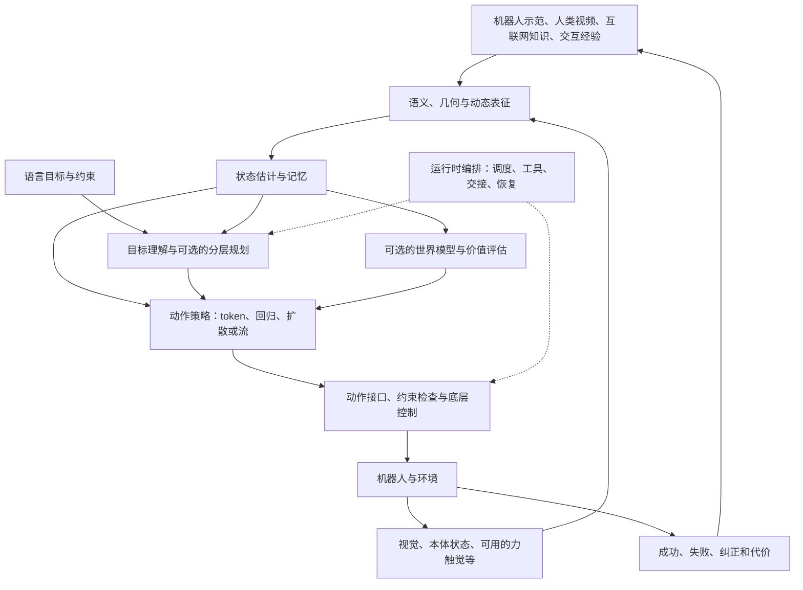
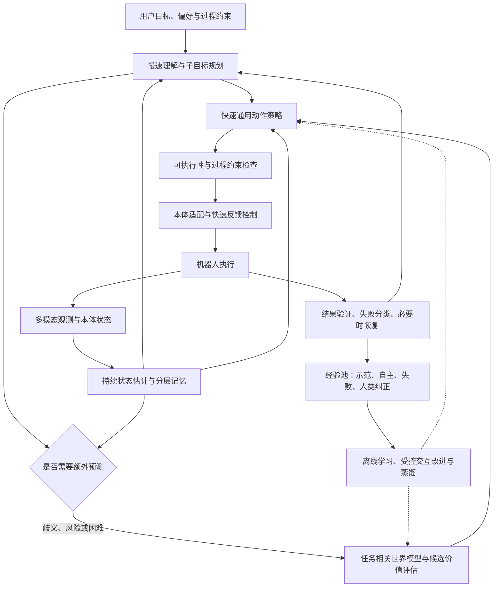

# VLA 技术路线综述：从动作生成到世界模型与具身系统

> [!abstract] 先读这段
> **VLA 正在从“根据图像和语言模仿动作”，扩展为“理解目标、估计状态、预测后果、选择动作、检查结果，并从交互中改进”的具身系统。**
> 不同路线解决的是不同瓶颈：动作头决定怎样生成控制序列；世界模型提供后果预测；记忆保留当前画面中缺失的信息；RL 利用成功、失败和代价；harness 组织规划、工具、策略交接和恢复。它们大多可以组合。
> **我的判断：较可能收敛的形态是共享表征、多时间尺度、具备记忆与预测能力的闭环系统。** 大模型承担理解与必要的规划，快速策略和底层控制处理连续动作与接触反馈；世界模型、价值估计和约束检查按需参与决策。具体动作头是否永远采用 flow matching、是否一定使用 MoE，目前没有定论。

## 1. 阅读范围与证据规则

本笔记以 **2026-09-22** 为检索截止日，选择能代表机制转变的论文，覆盖 CoRL、RSS、ICLR、ICML、NeurIPS、CVPR，以及 Nature、Nature Machine Intelligence、Science Robotics、IJRR。这是一份**问题驱动的代表性综述**，不声称穷尽所有论文，也不按榜单分数评选统一冠军。

- **已发表论文**：优先核验官方 proceedings、期刊页面和作者公开论文。
- **新近技术报告**：保留 LingBot-VLA 2.0、LingBot-VA 2.0、DreamZero、Cosmos Policy、RoboHarness 等重要方向，但单独标注预印本；未核验到录用记录不等于确定未录用。
- **作者报告**：文中实验发现来自论文，并非本项目独立复测。
- **本文分析**：优缺点、方向判断和我们的实验建议，是基于文献的综合推理，不是所有作者共同给出的结论。
- **相邻研究**：DreamerV3、HIL-SERL、ReKep、ELLMER 等提供关键方法，但并不都属于狭义的端到端 VLA。

论文会同时涉及多个方向。第 10 节给出原始来源与发表状态；正文也在关键结论附近提供来源，便于直接回查。

### 两个需要先修正的概念

**第一，π0 是重要分水岭，VLA 的起点早于 π0。** RT-2 在 2023 年已明确把机器人动作作为视觉语言模型的输出；Diffusion Policy 在 RSS 2023 已研究连续动作分布生成。π0 于 2024 年公开、发表于 RSS 2025，把预训练 VLM、独立动作专家和 flow matching 连续动作块结合起来，推动了这一架构成为重要基线。[RT-2](https://proceedings.mlr.press/v229/zitkovich23a.html)、[Diffusion Policy](https://diffusion-policy.cs.columbia.edu/)、[π0](https://www.roboticsproceedings.org/rss21/p010.html)。

**第二，VLM 不一定先输出一段文字推理，再把文字交给动作头。** 在典型连续动作 VLA 中，视觉和语言变成内部 token/特征，动作专家通过注意力等机制利用这些表示。显式子任务、CoT 或外部规划器是进一步的设计选择。动作专家也不一定是一个很小的末端 MLP，它可以是完整的 Transformer 模块。[π0 方法](https://arxiv.org/html/2410.24164v1)。

## 2. 总体地图：技术路线实际分布在哪些层

为避免把“世界模型”和“RL”误认为只能二选一，先把系统拆成六个问题。

| 层次 | 核心问题 | 主要技术选择 |
| --- | --- | --- |
| 表征与数据 | 从什么经验学习，怎样表示机器人与世界？ | VLM、视频表征、3D、跨本体数据、人类视频、潜动作、多模态传感 |
| 状态与记忆 | 现在处于什么状态，哪些事实当前看不到？ | 多帧历史、递归状态、感知与语义记忆、经验检索 |
| 决策与预测 | 做什么，做了会怎样？ | 直接策略、显式/潜在推理、子目标、世界模型、价值函数 |
| 动作生成 | 怎样输出未来控制序列？ | 离散 token、连续回归、扩散、flow matching、分层动作表示 |
| 学习信号 | 怎样从数据或交互变好？ | 行为克隆、表征蒸馏、辅助预测、RL、人类纠正、技能蒸馏 |
| 运行时 | 怎样及时执行、验证、恢复？ | 动作块、异步推理、快速反馈、约束检查、harness、策略交接 |

这是本文的综合分类图，不是某篇论文的架构复刻。“可选”表示不同任务的收益与计算成本不同，并不要求每个模型同时包含全部模块。

**动作的物理含义是另一条独立轴。** token、flow matching 或扩散都可以表达关节目标、末端位姿增量或其他控制量；生成方法本身不决定预测关节还是末端。还必须核对绝对/增量、参考坐标系、单位、手部表示、控制频率，以及是否由底层控制器转换执行。同样，“VLA”不意味着视觉和语言是全部输入，本体状态经常也是条件的一部分。

## 3. 路线演化：从哪几个问题分叉出来

| 阶段 | 已有进展 | 暴露的问题 | 分出的方向 |
| --- | --- | --- | --- |
| 2022–2023：语言进入机器人系统 | 高层语言规划、视觉语言知识迁移、生成式动作策略 | 文字知识与控制精度之间有距离 | RT-2 式动作 token；Diffusion Policy 式连续动作；反馈驱动的高层规划 |
| 2024：通用策略与 π0 阶段 | OpenVLA、Octo、π0 等把大规模预训练与机器人动作联系起来 | 离散解码效率、复杂动作、多机器人接口、长任务失败 | 动作块、动作专家、连续生成、开放基座与跨本体训练 |
| 2025：泛化与系统能力扩展 | FAST/OFT、π0.5、SpatialVLA、VPP、RL 后训练等 | 单帧状态不足、真实交互与示范分布不同、延迟影响控制 | 压缩动作、推理与记忆、视频预测、RL、实时执行 |
| 截至 2026-09：进一步组合 | CVPR/ICLR/RSS 的记忆、潜在推理、接触反馈、因果视频动作模型；新近 WAM 与 harness 报告 | 后果预测不可靠、技能交接、接触精度、运行成本、长期经验管理 | 预测与动作联合学习、经验闭环、多模态反馈、按需规划和可检查的执行系统 |

这个时间轴表示公开研究的扩展，不表示新路线已经替代旧路线。较小的监督学习策略在固定任务中仍可能是最合适的方案。

## 4. 十二条主要技术路线

各路线下的“优势、局限、未来方向”均为本文的机制分析；实验支持范围单独说明。

### 4.1 离散动作 token：把机器人动作纳入序列建模

**由来与动机。** RT-2、OpenVLA 沿用语言模型的序列预测接口，把动作分量离散成 token。这样可以继承已有 VLM 和自回归训练工具链，把语义理解与控制统一到同一个预测问题中。[RT-2](https://proceedings.mlr.press/v229/zitkovich23a.html)、[OpenVLA](https://proceedings.mlr.press/v270/kim25c.html)。

**怎样工作。** 输入图像、语言以及模型支持的状态，模型逐个预测动作 token，再解码回机器人控制量。这里的“动作 token”不是自然语言单词。最朴素的逐维分桶会丢失精度，也没有充分利用轨迹的时间相关性。

FAST 将一段连续动作先做时域压缩，再组织为较短的 token 序列。它说明离散路线还可以通过动作表示改进，而不必停留在逐关节、逐时刻分桶。论文中更快的**训练收敛**结论不能直接改写成相同比例的在线控制加速。[FAST，RSS 2025](https://www.roboticsproceedings.org/rss21/p012.html)。

**优势。** 与语言序列统一的训练接口比较成熟；容易混合文本任务和动作任务；压缩 token 能减少序列长度；动作似然便于部分 RL 方法使用。

**局限。** 量化存在表示误差；长动作序列的串行解码影响延迟；token 预测正确率与闭环任务质量并非同一指标；更好的 tokenizer 仍需验证接触阶段的细节是否被保留。

**未来方向。** 更好的时间与空间压缩、分层动作码、离散语义计划与连续精修结合、减少串行解码。不能仅凭“连续更自然”就断言离散方案将消失。

### 4.2 连续动作生成：扩散、flow matching 与直接回归

**由来与动机。** 同一观测可以有多条可行轨迹，例如从物体左侧或右侧绕行。单一均方误差回归容易在多峰分布中给出不合适的折中；逐 token 输出又存在效率瓶颈。Diffusion Policy 用生成式策略表示连续动作分布，π0 将此类思想与 VLM 和专门的动作专家结合。[Diffusion Policy](https://diffusion-policy.cs.columbia.edu/)、[π0](https://www.roboticsproceedings.org/rss21/p010.html)。

**怎样工作。** 可以用下面的简化条件流模型理解，符号方向是本文为讲解统一定义的：

$$
A=(a_t,\ldots,a_{t+H-1}),\qquad c=f(I_t,l,s_t),
$$

$$
x_\tau=(1-\tau)\epsilon+\tau A,\qquad
\mathcal L_{\mathrm{FM}}=\mathbb E\left[\left\|v_\theta(x_\tau,\tau,c)-(A-\epsilon)\right\|^2\right].
$$

训练时，从真实动作块与噪声构造中间状态，学习把噪声送到动作分布的向量场；推理时，从噪声出发积分/迭代得到动作块。实际论文可能采用不同时间方向、噪声分布和损失形式。**内部生成时间 $\tau$ 与机器人真实执行时间 $t$ 是两回事。**

也不能把“连续动作”直接等同于“必须去噪”。OpenVLA-OFT 采用并行动作预测、动作块与连续 L1 回归，在其评测中表现出强竞争力。这是评估复杂生成头时不可忽略的简单对照。[OpenVLA-OFT，RSS 2025](https://arxiv.org/abs/2502.19645)。RDT-1B 则代表以扩散 Transformer 为中心、融合视觉与语言条件的双臂基础策略，不必都采用 π0 式 VLM 主干结构。[RDT-1B，ICLR 2025](https://proceedings.iclr.cc/paper_files/paper/2025/file/49f80e4d2471ad4f2edf4f5f1ab62339-Paper-Conference.pdf)。

**优势。** 适合高维连续动作块与多模态轨迹；能同时建模双臂和时间相关性；动作模块与语义模块可以采用不同容量和更新方式。

**局限。** 多次去噪/积分增加延迟；动作块内部执行可能缺少新反馈；不会仅因输出连续值就自动满足运动学、碰撞或接触力约束；控制精度仍受示范、标定、动作接口和反馈影响。

**未来方向。** 少步生成、蒸馏、粗到细动作、动态块长与高频反馈结合。应把成功率、延迟和动作精度一起比较，验证多步生成相对简单回归究竟解决了什么问题。

### 4.3 推理与分层：让“做什么”与“怎么执行”有不同时间尺度

**由来与动机。** 长任务中，失败常常来自顺序、目标选择或状态判断，而非动作曲线不够平滑。“收拾桌面”需要决定对象、阶段和完成条件，单个瞬时动作监督对此不充分。

ECoT 给 VLA 增加包含计划、子任务和几何依据的推理监督；π0.5 将高层语义预测与低层动作、网络知识、多机器人数据联合训练。两者都扩展了训练信号，但不应简单视为相同的“两模型串联”。[ECoT，CoRL 2024](https://proceedings.mlr.press/v270/zawalski25a.html)、[π0.5，CoRL 2025](https://proceedings.mlr.press/v305/black25a.html)。

**三种常见实现。**

1. 显式文字推理：输出子任务、物体位置或操作理由，再预测动作。
2. 高低层分工：较慢的规划器给出子指令/子目标，较快的策略执行。
3. 潜在推理：将计划压缩为内部表示，降低每轮生成长文本的成本。Fast-ThinkAct 用教师推理监督形成可与语言关联的潜在规划表示，代表这类效率方向。[Fast-ThinkAct，CVPR 2026](https://openaccess.thecvf.com/content/CVPR2026/html/Huang_Fast-ThinkAct_Efficient_Vision-Language-Action_Reasoning_via_Verbalizable_Latent_Planning_CVPR_2026_paper.html)。

**优势。** 有助于组合任务、指令修改与阶段管理；显式计划便于诊断；高层可以融合知识和工具。

**局限。** 语言推理可能与真实场景脱节；生成的解释不一定忠实反映动作决策；长 CoT 会占用时间；拆分错误会传递给底层；错误子目标可能让低层再强也无法成功。

**未来方向。** 只在歧义、失败或阶段切换时增加推理；由状态变化触发重规划；用几何、接触和可执行性约束推理；将昂贵教师规划蒸馏到低延迟策略。

**特别判断。** 长时程能力应以完整任务和恢复能力验证，不能只用输出计划的流畅程度证明。

### 4.4 空间与几何：把语义对象落实到可操作的物理关系

**由来与动机。** 识别“杯子”与控制手靠近杯柄是不同问题。二维语义表征未必充分刻画深度、姿态、遮挡和双臂相对关系。

SpatialVLA 在 VLA 中引入 Ego3D 位置编码与自适应动作网格；ReKep 则将视觉语言描述转化为三维关键点关系和可优化的约束。前者主要改变学习表征，后者主要改变任务到控制的表示与求解过程。[SpatialVLA，RSS 2025](https://www.roboticsproceedings.org/rss21/p011.html)、[ReKep，CoRL 2024](https://proceedings.mlr.press/v270/huang25g.html)。

**优势。** 更直接地表达空间关系、相对运动和操作条件；有助于分离对象外观与任务几何；显式几何便于检查误差来源。

**局限。** 依赖深度、标定、位姿或关键点质量；遮挡、反光和形变物体会破坏估计；关键点关系不能完整描述摩擦、顺应性和灵巧手接触；跨机器人仍需动作与坐标系适配。

**未来方向。** 结合语义、3D、物体运动和接触状态；训练对标定误差和传感缺失鲁棒的表征；由模型估计不确定性，并决定是否改变视角或重新观察。

对 RM65-B，三台 D435 能提供多视角信息，但“有深度相机”与“策略已经使用可靠的标定深度”不是同一件事。具体数据输入应以实际管线为准。

### 4.5 世界模型与 WAM：预测未来究竟用来做什么

**由来与动机。** 行为克隆主要回答“此时专家会怎么做”，并不显式要求模型区分多个候选动作将产生什么后果。世界模型方向希望从视频和交互中获得动态先验，并利用预测改善动作选择。机器人视觉预测与规划早于 π0；GR-1 已将大规模视频预训练、未来图像与动作预测联系起来。[视觉规划前史，CoRL 2017](https://proceedings.mlr.press/v78/frederik-ebert17a.html)、[GR-1，ICLR 2024](https://arxiv.org/abs/2312.13139)。

#### 四种机制不能混为一谈

| 机制 | 训练增加什么 | 在线时怎样使用 | 代表与关键边界 |
| --- | --- | --- | --- |
| A. 未来预测作为辅助监督 | 对齐未来图像、深度或视频特征 | 表征影响动作，不必实际生成可观看的视频 | LingBot-VLA 2.0；预测特征不等于进行候选动作搜索 |
| B. 未来视觉计划/表征指导动作 | 学习未来视觉变化，再将其连接到动作 | 预测表示作为动作策略或逆动力学的条件 | VPP；可以使用视频模型内部特征，不必完整解码未来视频 |
| C. 视频与动作联合生成 | 联合学习未来视觉状态及对应控制序列 | 同时或交错预测视频潜变量与动作，持续接收真实观测 | LingBot-VA、DreamZero；要验证视觉未来与动作是否相容 |
| D. 动作条件动力学用于规划或学习 | 学习给定动作后的状态、奖励或价值变化 | 比较候选动作，或在模型想象中训练策略 | V-JEPA 2-AC、Cosmos Policy 的规划模式、DreamerV3；这几者的任务与实现不同 |

**A：与你当前模型最相关。** LingBot-VLA 2.0 的 dual-query distillation 用当前与未来 query，接受深度教师与因果视频表征教师的监督。其重点是让 VLA 内部获得几何和未来变化信息。单凭这一辅助任务，不能称其默认在线控制在执行“先生成完整视频，再评估多条动作”。[LingBot-VLA 2.0 §4.2](https://arxiv.org/html/2607.06403v1)。

这里的未来真实帧来自离线轨迹，是训练监督；在线执行时只能预测未来，不能读取尚未发生的真实画面。辅助分支是否在某个微调配置中启用，还要另查配置，不能从模型论文反推每一次训练都在使用它。

**B：让视频知识成为控制条件。** VPP 从预训练视频预测模型中提取预测性表示，供后续动作策略学习使用。这里重要的是视频模型中与运动有关的信息能否转移，而不是生成视频是否足够好看。[VPP，ICML 2025](https://proceedings.mlr.press/v267/hu25g.html)。

**C：更接近狭义 WAM 的核心。** LingBot-VA 将视觉动态与动作置于因果、交错的序列中；DreamZero 从视频扩散基座出发联合生成未来视频与动作。二者都尝试把视觉变化与可执行控制绑定，但具体主干、时间组织和部署方式不同。[LingBot-VA，RSS 2026](https://www.roboticsproceedings.org/rss22/p016.html)、[DreamZero，2026 预印本](https://arxiv.org/abs/2602.15922)。

截至检索日，LingBot-VA **2.0** 又提出面向动作的视觉 tokenizer、从头进行因果预训练、稀疏 MoE 和异步执行。应与原始 LingBot-VA、以及 **LingBot-VLA 2.0** 分开记录；本次按技术报告对待。[LingBot-VA 2.0](https://arxiv.org/abs/2607.08639)。

**D：从预测走向选择。** V-JEPA 2 的动作条件扩展在潜空间预测并用于视觉目标规划；Cosmos Policy 同时学习动作、未来状态与价值，并支持额外的候选评估；DreamerV3 在想象轨迹中学习策略。**预测模块可以服务训练，也可以服务在线搜索，两者计算成本完全不同。**[V-JEPA 2](https://arxiv.org/abs/2506.09985)、[Cosmos Policy](https://arxiv.org/abs/2601.16163)、[DreamerV3，Nature 2025](https://www.nature.com/articles/s41586-025-08744-2)。

#### 这条路线为什么有吸引力

视频提供“物体怎样运动、动作怎样改变场景”的监督，能利用不含机器人动作标签的数据；预测任务可能迫使模型保留与操作有关的动态信息；动作条件模型还提供在真正执行前比较方案的可能。

#### 主要困难

- **视觉合理不等于物理可行。** 预测可能忽略摩擦、刚度、力、不可见接触，以及当前机器人够不够得到。
- **观察相关性不等于动作因果性。** 仅预测常见未来，不保证能正确回答“如果改做另一动作会怎样”。
- **误差会积累。** 长预测和模型内策略优化可能利用模型漏洞，获得虚假的高价值。
- **训练与推理都可能昂贵。** 联合视频动作生成、多个候选 rollout 和价值评估不能视为零成本。
- **“零样本”需要明确对象。** 未见任务、未见场景、未见本体是不同条件；新机器人仍可能需要接口数据或短时适配。

**未来方向。** 我更看好能表达任务相关状态、接触和不确定性的预测，而不要求所有场景都生成高分辨率视频。实际观测应持续纠正想象；只有在预测能够改变动作选择时才增加搜索预算。评测应同时检查动作结果、候选排序质量和计算代价。

### 4.6 记忆与状态估计：解决“当前画面看起来一样，但该做的动作不同”

**由来与动机。** 按过一次按钮与尚未按过，画面可能近乎相同；被手遮住的物体、已完成的步骤和之前的失败，也不能从当前单帧恢复。这是部分可观测控制问题，单纯扩大 VLM 不会自动提供缺失的历史。

MemoryVLA 将低层感知细节与较高层语义保存在可检索的记忆中，再融合当前信息生成动作。它代表策略内部的时序状态扩展。[MemoryVLA，ICLR 2026](https://shihao1895.github.io/MemoryVLA/)。

**需要区分三类记忆。** 当前任务内的短期历史，用来消除状态歧义；跨阶段的任务记忆，用来记录完成条件和对象状态；跨回合的经验记忆，用来检索策略能力和失败恢复。RoboHarness 更接近第三类与高层编排的结合，详见 [[RoboHarness精读-异构策略编排与记忆桥]]。

**优势。** 对非马尔可夫任务有直接作用；有机会减少重复尝试；经验检索可在不更新全部参数时改善决策。

**局限。** 历史越长并不一定越好；错误记忆和过期对象状态会误导；相似外观可能检索到不同物理情境；测试期间是否持续写入记忆会改变评测协议。

**未来方向。** 任务相关的压缩、事件记忆、状态置信度、遗忘机制；区分事实、推测与预测；设计只有正确使用历史才能完成的任务，并控制初始记忆条件。

### 4.7 数据与跨本体：用异构经验扩大技能覆盖

**由来与动机。** 单机器人、单实验室的示范难以覆盖真实世界。互联网知识有语义但通常缺少控制量；人类视频有动作效果，但没有目标机器人的关节指令；不同机器人动作维度、单位、坐标系和控制频率又不相同。

Octo 研究从异构机器人数据训练可适配的通用策略；π0.5 将语义与动作相关任务共同训练；LAPA 从视频学习潜动作，再用机器人数据将其落到真实控制；UniVLA 进一步研究跨本体视频中的任务相关潜动作。[Octo，RSS 2024](https://roboticsconference.org/2024/program/papers/90/)、[π0.5](https://proceedings.mlr.press/v305/black25a.html)、[LAPA，ICLR 2025](https://proceedings.iclr.cc/paper_files/paper/2025/hash/45d74e190008c7bff2845ffc8e3facd3-Abstract-Conference.html)、[UniVLA，RSS 2025](https://github.com/OpenDriveLab/UniVLA)。

**常见实现。**

| 方法 | 希望保留的共性 | 仍需解决的本体差异 |
| --- | --- | --- |
| 统一动作槽位与 mask | 让相似语义的控制量共享训练接口 | 槽位不等于相同动力学；需核对单位、绝对/增量、关节与末端定义 |
| 本体专属编码器/解码器/adapter | 中间表征共享，输入输出适配 | 新硬件仍需数据和接口验证 |
| 潜动作预训练 | 从视频变化学习更抽象的动作表示 | 潜动作没有天然的机器人执行含义，需要 grounding |
| 多任务 co-training | 保留语义、空间理解、动作能力 | 数据比例和梯度冲突；不能假设任务越多越好 |
| MoE 或其他容量分配机制 | 在有限激活计算下容纳更多模式 | 路由稳定、负载均衡、专家退化、训练与部署复杂度 |

**MoE 的位置。** 它主要是容量与计算分配方案，既可用于动作专家，也可用于视频动作基座。没有专门监督或分析时，不能把一个专家解释为“倒水专家”，另一个解释为“抓取专家”。LingBot-VLA 2.0 是把跨本体数据、扩展动作空间、稀疏结构和预测监督组合的例子。[LingBot-VLA 2.0](https://arxiv.org/abs/2607.06403)。

**优势。** 增加对象、场景与运动覆盖；降低每项技能完全依赖昂贵遥操作的压力；语义与动作知识可相互补充。

**局限。** 原始数据小时数不能代表有效控制经验；不同本体的动作错配会形成有害监督；人类视频不提供真实接触力与机器人可达性；数据质量和覆盖难以与模型架构的贡献分开。

**未来方向。** 从单纯扩大规模转向质量、失败类型、控制方式和本体信息明确的数据组织；自动发现数据缺口；保持通用表征的同时建立可验证的本体适配层。π0.7 的官方报告把语言、视觉子目标和行为元信息作为可控条件，是这种组合方向的近期例子，但本次未核验其会议/期刊录用。[π0.7，2026 技术报告](https://www.pi.website/blog/pi07)。

### 4.8 强化学习与交互后训练：从“像示范”转向“完成目标”

**由来与动机。** 监督学习主要拟合数据中的动作。部署后策略会进入示范稀少的偏差状态，也可能需要在成功、耗时、精度和接触代价之间权衡。RL 用交互结果评价行为，为纠错、探索与任务级优化提供学习信号。

行为克隆与 RL 的目标差异可以简化表示为：

$$
\mathcal L_{\mathrm{BC}}=\mathbb E_{(o,l,a)\sim D}[\ell(\pi_\theta(o,l),a)],
\qquad
J(\theta)=\mathbb E_{\pi_\theta}\!\left[\sum_t\gamma^t r_t\right].
$$

BC 公式只示意动作监督，生成式策略有各自的具体损失。关键差别是 RL 的轨迹分布受当前策略影响，训练可以依据动作造成的结果调整行为。

#### 五种实际组合

| 组合方式 | 具体更新什么 | 代表性依据与适用边界 |
| --- | --- | --- |
| 直接对预训练策略做策略优化 | VLA 或选定参数子集，根据 rollout 与奖励更新 | VLA-RL；NeurIPS 2025 的 VLA 泛化实证。不能把一种 token 策略的 PPO 配方原样视为所有 flow 策略配方 |
| 对扩散/生成过程做策略优化 | 把生成过程纳入可优化的策略描述 | DPPO，ICLR 2025；证明扩散策略可以做 RL，不自动证明大规模 VLA 同样稳定 |
| 价值/优势条件化的策略改进 | 学价值、估计动作优势，再学习条件化动作策略 | RECAP / π*0.6；属于 RL，但不是标准 PPO 训练循环 |
| 任务专用 RL、局部纠偏或残差控制 | 只优化接触阶段或有限控制模块 | HIL-SERL 说明真机视觉 RL 可用于精细操作；“在 VLA 外加残差”的具体方案仍需单独设计和验证 |
| RL 生成经验，再蒸馏给通用策略 | 专家技能通过 RL 改进；通用模型用这些数据训练 | RLDG，RSS 2025；最终通用模型不必本身经历在线策略梯度训练 |

原始依据：[VLA-RL](https://arxiv.org/abs/2505.18719)、[DPPO](https://proceedings.iclr.cc/paper_files/paper/2025/hash/c0749c39aaff9e9e4c91f7118bf21b1e-Abstract-Conference.html)、[RECAP](https://arxiv.org/html/2511.14759v2)、[HIL-SERL](https://hil-serl.github.io/)、[RLDG](https://www.roboticsproceedings.org/rss21/p028.html)。

**RECAP 值得特别理解。** 它混合示范、自主执行和人工介入，训练价值函数，再根据优势构造改进条件。策略可继续使用适合 VLA 的动作学习形式，而不要求直接计算完整连续生成策略的 PPO 比率。这说明“VLA+RL”在算法上远不止 PPO 一种形态。[π*0.6 方法](https://arxiv.org/html/2511.14759v2)。

**人类纠正也不自动等于 RL。** 纠正轨迹如果仅进入动作监督训练，是交互式模仿学习；如果还通过奖励、价值或策略改进目标使用结果，才应讨论对应的 RL 机制。论文含有“自主 rollout”也不足以证明做了 RL。

**实验支持与边界。** NeurIPS 2025 的实证在其测试中发现 PPO 对语义与执行泛化有较明显帮助，而视觉鲁棒性与 SFT 接近。因此不能推导为“RL 会自动补齐视觉泛化”。HIL-SERL 的真机精细操作结果支持任务级 RL 的实用性，但它不是已经验证任意通用 VLA 可直接迁移所有灵巧手任务。[VLA 泛化实证](https://proceedings.neurips.cc/paper_files/paper/2025/hash/8c0fabe372177d2aded596be2d3b4544-Abstract-Conference.html)、[HIL-SERL，Science Robotics 2025](https://doi.org/10.1126/scirobotics.ads5033)。

**优势。** 直接利用失败和纠错状态；可以优化成功、耗时、精度、动作代价等目标；有机会超过示范者在特定指标上的表现。

**局限。** 奖励定义可能偏离真实目标；探索与复位成本高；稀疏奖励、训练不稳定和遗忘通用能力；仿真中的改进可能依赖不真实的接触和观测；奖励高不一定意味着遵守全部语言条件。

**未来方向。** 先用示范建立能力，再利用自主经验与少量人工纠正改进；混合离线与在线数据；用任务结构、价值估计和可检查条件降低奖励稀疏性；把改进后的局部技能蒸馏回通用模型。训练日志必须记录失败、介入与重置的成本。

### 4.9 多模态接触反馈：视觉之外的力、触觉与声音

**由来与动机。** 插接是否到底、手指是否打滑、压紧力是否足够、物体是否卡住，未必能从 RGB 可靠判断。灵巧手尤其需要区分“手指移动了”与“形成了稳定接触”。

FuSe 研究以语言为联系，适配触觉、音频等异构传感；ForceVLA2 将力相关概念与实时力信号结合，输出混合力位控制；HEAR 强调动作块执行期间持续捕捉声音事件，避免低频观测遗漏关键声音。[FuSe，ICRA 2025](https://fuse-model.github.io/)、[ForceVLA2，CVPR 2026](https://openaccess.thecvf.com/content/CVPR2026/html/Li_ForceVLA2_Unleashing_Hybrid_Force-Position_Control_with_Force_Awareness_for_Contact-Rich_CVPR_2026_paper.html)、[HEAR，作者宣布 IJRR 接收](https://hear.irmv.top/)。

**优势。** 能观测视觉之外的接触与物体内部状态；提高异常检测与精细调节的可观测性；让动作过程中出现的新证据参与控制。

**局限。** 新传感器带来时间同步、标定和跨硬件迁移问题；信号可能噪声大且高度依赖接触安装；训练数据更稀缺；如果模型更新频率跟不上变化，仅把传感器拼到输入里也未必有效。

**未来方向。** 让慢速语义策略设定接触目标，由快速反馈层调节；学习传感缺失下的鲁棒行为；通过主动动作收集证据，例如轻触判断位置。力、触觉和声音互补，但不能相互视为等价替代。

对本项目，目前已知的是灵巧手与三路 D435；是否有可用的腕部力传感、指尖触觉或电流接口，需要另行核查。不能仅凭“灵巧手”就假设具备触觉闭环。

### 4.10 实时与高效执行：模型输出得快，才可能及时闭环

**由来与动机。** 模型可以一次预测很多动作，但计算时机器人和物体仍在运动。若新动作依据的是较早图像，策略面对的实际状态已改变；若等待模型又会造成停顿。动作块长度同时影响计算摊销与反馈延迟。

RTC 在动作执行与新块生成之间安排重叠，用已承诺执行的前缀约束后续生成；SmolVLA 则包含小模型和异步推理栈的研究。OFT 的并行动作预测也属于效率改进的重要对照。[RTC，NeurIPS 2025](https://arxiv.org/abs/2506.07339)、[SmolVLA](https://arxiv.org/abs/2506.01844)、[OpenVLA-OFT](https://arxiv.org/abs/2502.19645)。

**必须分开记录的量。** 模型一次前向/生成耗时、动作块覆盖时长、新观测进入决策的频率、机器人命令发送频率、底层伺服频率。把一个动作块以 50 Hz 发给机器人，不代表大模型每秒重新观察并决策 50 次。

**优势。** 减少执行停顿与陈旧动作；使大模型更可能适配真实控制；可以把计算资源用于真正困难的决策。

**局限。** 异步执行需要处理时间戳、状态漂移和交接连续性；已执行的动作不能由新预测撤回；缓存会占资源；小模型或强蒸馏可能牺牲覆盖与泛化。

**未来方向。** 根据运动速度和不确定性调整块长、生成步数与推理频率；把视觉语义更新和快速本体反馈分开；采用端到端闭环延迟评测，而不仅报告模型吞吐量。

### 4.11 Harness 与异构策略编排：把已有能力组成可靠执行系统

**由来与动机。** 一个模型可能泛化抓取很好，却不擅长高精度装配；一个 RL 专家在局部状态下很准，却不理解长任务；规划器在结构化几何场景稳定，却容易受感知或接触建模误差影响。系统因此需要选择工具、调用技能、检查结果和恢复。

这种思想有明确前史。Inner Monologue 利用反馈更新高层语言规划；ELLMER 用检索到的经验以及视觉、力反馈完成长任务。RoboHarness 将异构机器人策略的能力判断与交接作为重点。[Inner Monologue，CoRL 2022](https://proceedings.mlr.press/v205/huang23c.html)、[ELLMER，Nature Machine Intelligence 2025](https://www.nature.com/articles/s42256-025-01005-x)、[RoboHarness](https://arxiv.org/abs/2607.18060v2)。

**名称边界。** 本文把你提到的“harnessVLA”理解为给 VLA 配套运行时系统这一方向；其中重点案例是已有精读的 **RoboHarness**。它不是一种与 π0 同级的新动作主干名称，也不是从 2026 年才首次出现的机器人分层控制思想。

**RoboHarness 的关键。** 不仅决定下一步用哪个策略，还要判断当前状态能否让它接手。Memory Bridge 用经验检索、局部状态评分和规划，把系统移向下一策略更熟悉的状态。它编排 π0.5、RL 后训练的 OpenVLA-OFT 与 TAMP，底层并未端到端联合训练。其仿真评测允许部分系统更新跨回合保留，比较时应区分冻结记忆与持续适配协议。详见 [[RoboHarness精读-异构策略编排与记忆桥]]。

**优势。** 可复用已有 VLA、RL 和规划器；便于观察失败发生在哪个阶段；局部替换一个技能不必重训全部系统；能明确加入验证、重试、恢复与人工交接。

**局限。** 高层推理与工具调用有成本；能力估计可能不准；策略边界、数据格式、状态分布和时序接口难以统一；模块越多，错误传播路径越复杂；持续记忆可能让实验难以复现。

**未来方向。** 把能力前提、完成条件和可接手状态写成可检验的接口；学习交接与恢复策略；限定重试和计算预算；将重复的高层决策逐渐蒸馏为稳定低延迟行为。

**不能过度推出的结论。** RoboHarness 的特定组合实验不能证明“所有 VLA 最后都要被 coding agent 调度”，也不能证明该系统天然适合当前 RM65-B。

### 4.12 可验证语言约束与任务规范：完成动作之外，还要遵守条件

**由来与动机。** “把杯子放到托盘”与“保持杯口向上，避开红区，先移动碗再放杯子”对最终状态可能有相似要求，但对中间过程的要求不同。只以终点成功奖励或文本条件训练，可能不能稳定约束整条轨迹。

ReKep 展示了把语言相关操作关系表达为几何约束并求解的方向；高层反馈系统展示了执行后检查的价值。但这还没有解决所有自然语言条件的自动、可靠形式化。[ReKep](https://proceedings.mlr.press/v270/huang25g.html)、[ELLMER](https://www.nature.com/articles/s42256-025-01005-x)。

**可以放在三个位置。** 训练时提供约束相关数据与损失；规划时筛选满足关系/顺序的候选；执行时检查可观测的几何、顺序、接触或动作条件。这三者可以组合，硬阈值、优化约束与学习判别器的保证程度不同。

**优势。** 将“成功但违规”从真正合格的操作中区分出来；便于定位模型究竟不理解要求，还是控制层执行不到位；适合与 RL 的奖励以及 harness 的完成检查结合。

**局限。** 语言可能含糊；感知误差会影响检查；约束之间可能冲突；检查器可能有误报/漏报；形式化控制保证依赖状态估计、动力学和可行性假设，不能扩展成整个 VLA 系统的无条件保证。

**未来方向。** 结合语义条件、时序规范、空间/接触约束和不确定性；检查失败后采取可诊断的恢复；在留出的新指令组合上测试。对我们而言，值得研究的是**哪些语言约束需要从软条件变成能影响动作选择和执行的明确条件**。

## 5. 三组最容易混淆的关系

### 5.1 VLA 与 WAM 是否在竞争

两者有竞争也有融合。以 VLM 初始化的模型强调语义先验，以视频或动态模型初始化的策略强调时空变化先验；具体模型可以同时具有两者。WAM 也不是完全统一的架构标准，不同论文对它的命名范围不同。

最有用的分类问题是：**预测对象是什么，预测是否以候选动作为条件，预测信息怎样影响最终动作，在线是否做搜索？** 名称中有 “World” 或 “Prediction” 不足以回答这些问题。

### 5.2 世界模型与 RL 是否必须绑定

不必须。未来预测可以只作为监督学习辅助；RL 可以直接在真实环境或仿真中进行而没有学习式世界模型；两者结合后，世界模型既可以提供训练中的想象轨迹，也可以提供在线候选评估。

模型内训练可能节省真实交互，但节省的是哪种成本需要实测：获得和训练动力学模型、纠正模型偏差本身也需要数据与算力。

### 5.3 模型能力与系统能力怎样区分

| 观察到的能力提升 | 可能的真正来源 | 建议对照 |
| --- | --- | --- |
| 长任务成功率提高 | 更强动作策略，也可能是更多重试、更好的分解或记忆 | 相同基座、相同时间与重试预算，逐项加入高层模块 |
| 动作更精确 | 更好数据、反馈、更高频控制、动作表示或 RL | 固定控制接口与数据，测实际位置/角度/接触误差 |
| 新场景泛化提高 | 语义预训练、动态先验，也可能是额外相似数据 | 数据覆盖审计与按变化因素划分的测试 |
| 推理更快 | 更短 token、更少采样步、缓存或不同硬件 | 同硬件、同输入、同块长与闭环质量 |
| 训练显存更低 | 激活参数、精度、序列长度、分片和检查点等 | 核对真实配置；不能仅用总参数量判断 |

最后一行与你之前对 π0.5 和 LingBot 的显存问题直接相关：**技术路线说明模型怎样工作，资源消耗还取决于实际实现与训练配置。** 本综述没有重新读取服务器作业，不将历史硬件或训练状态当作当前核验结果。

### 5.4 把熟悉的模型放回多维地图

下表仅归纳各报告的核心机制，不列所有可选模式，也不比较性能高低；来源对应第 10 节同名条目。

| 模型或系统 | 主要组合 | 容易误读之处 |
| --- | --- | --- |
| π0 | VLM 语义表征 + 连续 flow 动作专家 + 多本体示范 | 动作生成不要求每轮输出一段文字推理 |
| π0.5 | 上述基础 + 异构 co-training + 高层语义条件 | 泛化收益不能全归因于动作头改变 |
| LingBot-VLA 2.0 | VLM + 稀疏动作专家 + 跨本体动作接口 + 几何/未来特征监督 | 未来特征蒸馏不等于默认在线视频规划 |
| LingBot-VA / DreamZero | 视频动态先验 + 联合或交错的视频动作预测 + 闭环执行 | 能预测视觉未来，不等于任意候选动作后果都已准确建模 |
| Cosmos Policy | 视频基座中的动作生成 + 未来状态/价值学习 + 可选规划 | 直接策略推理与额外规划的计算预算要分开 |
| π*0.6 / RECAP | 通用 VLA + 价值学习 + 优势条件化 + 自主与纠正经验 | 使用 RL 不意味着算法就是 PPO |
| RoboHarness | 多种已有策略 + 能力判断 + 经验记忆 + 策略交接 | 是系统层方法，不是一个新动作主干 |

## 6. 文献共同支持什么，又还没有证明什么

### 已有较明确支持的方向

1. **动作表示与训练配方会显著影响性能，主干规模不是唯一变量。** FAST、OFT 提供不同于“只扩大模型”的直接例子。
2. **长任务需要超出单帧动作模仿的信息。** 推理、语义子任务和记忆分别对计划与状态歧义提供支持，代表为 ECoT、π0.5、MemoryVLA。
3. **未来信息可以进入控制，但形式很多。** VPP、LingBot-VLA 2.0、LingBot-VA 与潜空间规划代表不同机制。
4. **交互结果是重要训练资源。** VLA 泛化实证、RECAP、HIL-SERL 与 RLDG 分别支持直接策略改进、优势条件化、局部真机 RL 和经验蒸馏。
5. **闭环时间和反馈模态会改变系统行为。** RTC、ForceVLA2、HEAR 表明运行时与传感信息不能当作无关工程细节。

上述是各论文在不同设置中的证据汇总，来源见对应路线及第 10 节；并不是一项在统一硬件和数据上验证过的全栈消融。

### 尚不能据此断言

- 视频模型已学到足够准确的任意接触物理。
- WAM 在相同数据、计算与机器人上普遍优于 VLA。
- RL 提高 SR 后，就自动提高所有 OOD、语言约束遵守率和毫米级精度。
- CoT 越长越好、模型参数越多越好、模块越全越好。
- 一套统一动作维度就能直接迁移到任何本体，尤其是不同灵巧手。
- 在任务进度分数上的提升等于同等幅度的完整任务成功率提升。
- 某个长任务平均值证明系统可以长时间无人值守运行。

## 7. 我对未来形态的判断

> [!note] 这一节是研究判断
> 下述是综合推理与建议的目标架构，不是已经有论文完整证明的“最终答案”。较有把握的是功能需求；较不确定的是由几个网络、何种 tokenizer、哪种生成方法实现。

### 7.1 统一知识与表示，多时间尺度地感知和控制

我认为未来通用具身模型会趋向于统一学习语义、物体、动态与行为的表示，同时在执行上保留不同时间尺度：

- **较慢的目标理解与规划**：解释长指令，决定子目标，处理歧义和变化；只有需要时增加推理。
- **持续更新的任务状态与记忆**：知道已做过什么、哪些事实被遮挡、哪些失败不该重复。
- **快速动作策略**：基于最新观测、本体状态与子目标生成短期动作，处理大部分熟练行为。
- **按需使用的预测与价值估计**：困难或不确定时比较少量候选，平常可以直接行动。
- **快速反馈与可检查的执行层**：处理几何、动作限幅、接触调节、完成判定和异常恢复。

“共享表征”不要求这些功能必须全放在一个权重文件；“分层执行”也不要求每层必须是独立大模型。训练可以越来越联合，运行时仍可以按功能和频率组织。

### 7.2 我倾向的技术实现顺序

**第一层：以成熟连续动作基座建立强反应能力。** 当前可以从 VLM + 连续动作专家出发，保留回归、token 和 flow 的可比较接口。选择 flow matching 是可行起点，不应成为不能推翻的前提。

**第二层：共享任务相关的空间与动态表示。** 通过多模态数据、视频/几何辅助监督学习当前状态与未来变化。先证明表示有助于控制，再决定是否扩大为昂贵的视频联合生成模型。

**第三层：增加记忆与条件化目标。** 用任务状态、短历史、子目标与明确约束组织长任务；将复杂的教师推理逐步蒸馏为轻量决策。

**第四层：用经验闭环优化。** 从示范初始化，在机器人真实会犯错的状态收集交互与纠正；依据数据条件选择直接 RL、优势条件化、专用技能 RL 或 RL 数据蒸馏。保留广泛能力的回放与评测。

**第五层：运行时按需调用预测、规划和恢复。** 基座执行普通动作；不确定时调用世界模型或规划器；失败时从可验证状态恢复；持续记录实际成本与约束违反情况。

### 7.3 为什么不把未来押在单一路线上

语义知识不能替代接触反馈；流畅动作不能替代目标管理；视频预测不能替代实际执行验证；奖励优化不能自动知道未写入目标的要求。现实任务同时需要这些能力，因此**功能上的融合比某个缩写取代另一个缩写更可能持续发生**。

最大的未决问题是融合的程度：端到端训练能否以更低成本内化当前外部模块，还是保留可检查的模块边界更可靠。这个问题需要相同数据、时间、硬件和失效条件下的比较，不能仅由模型发布趋势决定。

## 8. 对 LingBot、RoboTwin 与 RM65-B 的研究建议

这一节是结合现有方向提出的实验规划，不表示已经训练、部署或证实有效。硬件配置以 [[RM65-B双臂机器人]] 为准；默认框架行为见 [[RoboTwin与LingBot-VLA默认流程对照]]。

### 8.1 主线建议：语言约束下的执行与交接，而非一次加入所有模块

建议保留 LingBot-VLA 2.0 作为当前主基座，将核心问题聚焦为：

> **在未见任务组合和执行偏差下，怎样把语言要求转成可检查的阶段条件，并利用反馈、记忆或局部策略改进，提高合规完成率与操作精度？**

这条问题能够连接语言约束、RL 和 harness，也能用现有 RoboTwin 与真机建立可解释的验证链。未来预测可以作为针对特定失败的增强项，而不是先把全部训练管线改成 WAM。

### 8.2 建议按失败机制增加对照

| 顺序 | 实验问题 | 主要对照 | 怎样判断值得继续 |
| --- | --- | --- | --- |
| A | 当前基座究竟在哪些情况失败？ | 固定数据、动作接口与评测预算的 LingBot 基线 | 得到可复现的失败分类，区分语义、感知、控制、记忆、交接 |
| B | 语言条件是否真正进入执行？ | 原始语言条件 vs 加入阶段/约束检查；保持动作基座相同 | 在新约束组合上提高合规完成率，而非只增加重试 |
| C | 历史是否是主要缺口？ | 无记忆、短历史、事件记忆 | 只有依赖过去信息的任务明显受益，排除额外算力解释 |
| D | 精密阶段是否需要交互优化？ | 增加纠正数据做 SFT、相同交互预算的 RL、RL 数据蒸馏 | RL 收益超过单纯新增数据，并改善具体误差与接触代价 |
| E | 多策略交接是否需要单独建模？ | 直接串联、状态兼容检查、兼容检查加桥接 | 后续策略能从交接状态稳定接手，且总耗时可接受 |
| F | 预测能否真正改变动作选择？ | 无未来监督、未来特征辅助、按需候选预测 | 在针对性场景提升闭环结果，且预测排序与结果相关 |

这些是建议的可分阶段消融，不要求一次训练所有组合。每个新增模块都应对应已观察的失败；否则很难解释收益来自哪里。

### 8.3 仿真到当前真机，需要保留的区别

RoboTwin 中的任务结果可以验证算法机制，不能直接证明 RM65-B 与灵巧手部署效果。本项目真机是双侧各六轴，动作维度与双七轴加夹爪数据不同；还要核对手的受控自由度、关节/末端指令、坐标系、频率、同步和传感可用性。

因此可以先在现有仿真本体上固定机制对照，再在 RM65-B 上选择少量与研究问题一致的任务验证。**避免同时更换本体、动作表示、数据、算法和传感输入后，把全部提升归因于某一个模块。** 适配信息链接到 [[RM65-B双灵巧手：LingBot-VLA2选型与适配路线]]，不在本综述中把接口假设当作已验证结论。

## 9. 怎样比较这些技术路线

| 维度 | 应记录的指标或协议 | 防止的误判 |
| --- | --- | --- |
| 基本完成能力 | 完整任务 SR、分阶段进度、失败类型；给出样本数与区间估计 | 把进度分数当成功率 |
| 操作精度 | 位置/角度误差、装配公差相关结果、掉落/滑移、可测的接触误差 | 把拿起来等同于高精度控制 |
| 语言遵守 | 最终成功且所有指定过程条件满足的比例；按约束类型拆分 | 成功终点掩盖中途违规 |
| 泛化 | 对象、外观、布局、指令、任务组合、本体分开测试 | 一个 OOD 总分掩盖具体弱项 |
| 长时程 | 完整链长度、失败后恢复、重试次数、阶段交接成功率 | 单技能 SR 高掩盖组合失败 |
| 记忆与适配 | 初始记忆、跨回合是否保留、是否在线更新 | 在线积累经验与冻结零样本混评 |
| 世界模型价值 | 预测质量、候选排序与实际结果关联、加入规划后的净收益 | 视频好看但控制不改善 |
| 学习成本 | 示范/交互小时、失败与介入次数、复位成本、GPU 时间 | 免费忽略 RL 交互或额外数据 |
| 运行成本 | 端到端延迟、陈旧观测时长、执行周期、外部模型调用与重试预算 | 只比较参数量或单模型吞吐 |

对约束任务，可先定义一个清楚的联合指标：

$$
\mathrm{CSR}=\frac{1}{N}\sum_{i=1}^{N}
\mathbb 1\{\text{任务成功，且本次指定的全部可验证约束满足}\}.
$$

这里将其暂称为**合规成功率**，是本项目建议的统计口径，不声称为领域统一标准。对软约束或不可可靠观测的条件，需另行定义评分与标注规则。

## 10. 代表文献与发表状态索引

下表按本文阅读用途组织。**正式发表年份与最早预印本年份可能不同**：例如 OpenVLA、ECoT、ReKep 属于 CoRL 2024，PMLR 页面出版时间为 2025；π0 在 2024 年公开，但是 RSS 2025 论文。

### 10.1 已核验的会议与期刊论文

| 文献 | 已核验状态 | 在本综述中的作用 |
| --- | --- | --- |
| [RT-2: Vision-Language-Action Models Transfer Web Knowledge to Robotic Control](https://proceedings.mlr.press/v229/zitkovich23a.html) | CoRL 2023 | VLM 到离散动作 token 的重要前史 |
| [Diffusion Policy: Visuomotor Policy Learning via Action Diffusion](https://diffusion-policy.cs.columbia.edu/) | RSS 2023；[IJRR 扩展版](https://doi.org/10.1177/02783649241273668)，2024 在线、2025 卷期 | 连续生成式动作策略；不是默认带 VLM 的基础模型 |
| [OpenVLA: An Open-Source Vision-Language-Action Model](https://proceedings.mlr.press/v270/kim25c.html) | CoRL 2024 | 开放的通用 VLA 与动作 token 基线 |
| [π0: A Vision-Language-Action Flow Model for General Robot Control](https://www.roboticsproceedings.org/rss21/p010.html) | RSS 2025 | VLM 与 flow matching 动作专家结合 |
| [RDT-1B: A Diffusion Foundation Model for Bimanual Manipulation](https://proceedings.iclr.cc/paper_files/paper/2025/file/49f80e4d2471ad4f2edf4f5f1ab62339-Paper-Conference.pdf) | ICLR 2025 | 扩散 Transformer 为中心的双臂基础策略 |
| [FAST: Efficient Action Tokenization for Vision-Language-Action Models](https://www.roboticsproceedings.org/rss21/p012.html) | RSS 2025 | 压缩连续动作序列，改进离散路线 |
| [Fine-Tuning Vision-Language-Action Models: Optimizing Speed and Success](https://arxiv.org/abs/2502.19645) | RSS 2025，作者 arXiv 录用信息 | OpenVLA-OFT；并行连续动作与训练配方 |
| [Robotic Control via Embodied Chain-of-Thought Reasoning](https://proceedings.mlr.press/v270/zawalski25a.html) | CoRL 2024 | ECoT，显式具身推理监督 |
| [π0.5: a Vision-Language-Action Model with Open-World Generalization](https://proceedings.mlr.press/v305/black25a.html) | CoRL 2025 | 异构 co-training、高层语义与低层动作 |
| [Fast-ThinkAct: Efficient Vision-Language-Action Reasoning via Verbalizable Latent Planning](https://openaccess.thecvf.com/content/CVPR2026/html/Huang_Fast-ThinkAct_Efficient_Vision-Language-Action_Reasoning_via_Verbalizable_Latent_Planning_CVPR_2026_paper.html) | CVPR 2026 | 潜在规划与推理成本 |
| [SpatialVLA: Exploring Spatial Representations for Visual-Language-Action Models](https://www.roboticsproceedings.org/rss21/p011.html) | RSS 2025 | 几何与空间动作表示 |
| [ReKep: Spatio-Temporal Reasoning of Relational Keypoint Constraints for Robotic Manipulation](https://proceedings.mlr.press/v270/huang25g.html) | CoRL 2024 | 相邻路线：关键点约束与优化控制 |
| [Unleashing Large-Scale Video Generative Pre-training for Visual Robot Manipulation](https://arxiv.org/abs/2312.13139) | ICLR 2024；[会议论文](https://openreview.net/attachment?id=NxoFmGgWC9&name=pdf) | GR-1，视频预训练与未来/动作预测 |
| [Video Prediction Policy: A Generalist Robot Policy with Predictive Visual Representations](https://proceedings.mlr.press/v267/hu25g.html) | ICML 2025 | VPP，以视频预测表示指导动作 |
| [Causal World Modeling for Robot Control](https://www.roboticsproceedings.org/rss22/p016.html) | RSS 2026 | LingBot-VA，因果视频—动作联合建模 |
| [Mastering diverse control tasks through world models](https://www.nature.com/articles/s41586-025-08744-2) | Nature 640, 647–653，2025 | DreamerV3；相邻路线：在世界模型中学习策略 |
| [MemoryVLA: Perceptual-Cognitive Memory in Vision-Language-Action Models for Robotic Manipulation](https://openreview.net/forum?id=54U3XHf7qq) | ICLR 2026；[作者项目](https://shihao1895.github.io/MemoryVLA/) | 感知与语义记忆 |
| [Octo: An Open-Source Generalist Robot Policy](https://roboticsconference.org/2024/program/papers/90/) | RSS 2024 | 异构数据与可适配的通用策略 |
| [Latent Action Pretraining from Videos](https://proceedings.iclr.cc/paper_files/paper/2025/hash/45d74e190008c7bff2845ffc8e3facd3-Abstract-Conference.html) | ICLR 2025 | LAPA，无动作标签视频到潜动作 |
| [Learning to Act Anywhere with Task-centric Latent Actions](https://github.com/OpenDriveLab/UniVLA) | RSS 2025，作者官方仓库及其论文链接 | UniVLA，任务相关潜动作与本体解码 |
| [Diffusion Policy Policy Optimization](https://proceedings.iclr.cc/paper_files/paper/2025/hash/c0749c39aaff9e9e4c91f7118bf21b1e-Abstract-Conference.html) | ICLR 2025 | DPPO，对扩散策略进行 RL |
| [What Can RL Bring to VLA Generalization? An Empirical Study](https://proceedings.neurips.cc/paper_files/paper/2025/hash/8c0fabe372177d2aded596be2d3b4544-Abstract-Conference.html) | NeurIPS 2025 | 区分语义、视觉与执行泛化收益 |
| [Precise and dexterous robotic manipulation via human-in-the-loop reinforcement learning](https://doi.org/10.1126/scirobotics.ads5033) | Science Robotics 10(105), eads5033，2025；[作者全文](https://hil-serl.github.io/static/hil-serl-paper.pdf) | HIL-SERL；相邻路线：真机精密技能 RL |
| [RLDG: Robotic Generalist Policy Distillation via Reinforcement Learning](https://www.roboticsproceedings.org/rss21/p028.html) | RSS 2025 | RL 专家经验蒸馏到通用策略 |
| [Beyond Sight: Finetuning Generalist Robot Policies with Heterogeneous Sensors via Language Grounding](https://fuse-model.github.io/) | ICRA 2025，作者项目页 | FuSe，异构传感与语言联系 |
| [ForceVLA2: Unleashing Hybrid Force-Position Control with Force Awareness for Contact-Rich Manipulation](https://openaccess.thecvf.com/content/CVPR2026/html/Li_ForceVLA2_Unleashing_Hybrid_Force-Position_Control_with_Force_Awareness_for_Contact-Rich_CVPR_2026_paper.html) | CVPR 2026 | 力感知与混合力位控制 |
| [Real-Time Execution of Action Chunking Flow Policies](https://arxiv.org/abs/2506.07339) | NeurIPS 2025，作者 arXiv 录用信息 | RTC，生成与执行重叠 |
| [Inner Monologue: Embodied Reasoning through Planning with Language Models](https://proceedings.mlr.press/v205/huang23c.html) | CoRL 2022，PMLR 2023 | 反馈驱动语言规划的前史 |
| [Embodied large language models enable robots to complete complex tasks in unpredictable environments](https://www.nature.com/articles/s42256-025-01005-x) | Nature Machine Intelligence 7, 592–601，2025 | ELLMER；相邻路线：检索、反馈与长任务系统 |
| [Self-Supervised Visual Planning with Temporal Skip Connections](https://proceedings.mlr.press/v78/frederik-ebert17a.html) | CoRL 2017 | 机器人未来视觉预测与规划的前史 |

### 10.2 已宣布接收但出版信息尚不完整

| 文献 | 本次核验到的状态 | 作用 |
| --- | --- | --- |
| [Towards the Vision-Sound-Language-Action Paradigm: The HEAR Framework for Sound-Centric Manipulation](https://hear.irmv.top/) | 作者项目页宣布 IJRR 接收，并说明尚未分配归档 DOI；[公开预印本](https://arxiv.org/abs/2603.16086) | 连续声音事件与动作块执行期间的感知 |

### 10.3 新近报告与预印本：按公开版本记录

下列条目未在本次检索中完成正式会议/期刊录用核验；这里不将其描述成已发表顶会论文。日期是本文所引用公开版本的年份/月份，不是模型能力成熟度排序。

| 文献 | 本文记录状态 | 作用 |
| --- | --- | --- |
| [SmolVLA: A vision-language-action model for affordable and efficient robotics](https://arxiv.org/abs/2506.01844) | 2025-06 预印本 | 小模型与异步执行 |
| [V-JEPA 2: Self-Supervised Video Models Enable Understanding, Prediction and Planning](https://arxiv.org/abs/2506.09985) | 2025-06 技术报告 | 潜在动态与动作条件规划；不是直接语言到动作基线 |
| [VLA-RL: Towards Masterful and General Robotic Manipulation with Scalable Reinforcement Learning](https://arxiv.org/abs/2505.18719) | 2025-05 预印本 | 大型 VLA 在线 RL |
| [π*0.6: a VLA That Learns From Experience](https://arxiv.org/abs/2511.14759) | 2025-11 技术报告 | RECAP、优势条件化与部署经验 |
| [Cosmos Policy: Fine-Tuning Video Models for Visuomotor Control and Planning](https://arxiv.org/abs/2601.16163) | 2026-01 预印本 | 动作、未来状态和价值；可选规划 |
| [World Action Models are Zero-shot Policies](https://arxiv.org/abs/2602.15922) | 2026-02 预印本 | DreamZero，视频基座与联合动作预测 |
| [A Steerable Model with Emergent Capabilities](https://www.pi.website/blog/pi07) | π0.7，2026-04 官方报告；[技术论文](https://www.pi.website/download/pi07.pdf) | 多模态条件、子目标与行为可控性 |
| [From Foundation to Application: Improving VLA Models in Practice](https://arxiv.org/abs/2607.06403) | LingBot-VLA 2.0，2026-07 预印本 | 跨本体、扩展动作、MoE 与未来特征蒸馏 |
| [Native Video-Action Pretraining for Generalizable Robot Control](https://arxiv.org/abs/2607.08639) | LingBot-VA 2.0，2026-07 预印本 | 面向动作的视觉表示与因果视频动作预训练 |
| [RoboHarness: Memory-Driven Orchestration of Heterogeneous Robot Policies for Long-Horizon Planning](https://arxiv.org/abs/2607.18060v2) | 2026-07，v2 预印本；本库已有全文精读 | 异构策略能力判断、记忆桥与交接 |

## 11. 后续阅读与维护

**建议阅读次序：** π0 → OFT/FAST → π0.5 → LingBot-VLA 2.0 与 LingBot-VA 对照 → RECAP/RLDG → MemoryVLA/RTC → RoboHarness/ReKep。分别回答动作、泛化、预测、交互、时序与系统组合问题，避免只跟随模型发布时间阅读。

关联笔记：

- [[LingBot-VLA2与π0、SmolVLA架构比较]]：已有基线的结构与输入输出。
- [[LingBot-VLA 2.0项目概述]]：代码与项目默认流程。
- [[RoboHarness精读-异构策略编排与记忆桥]]：系统编排与交接的详细证据。
- [[RoboTwin与LingBot-VLA默认流程对照]]：离线数据、训练和在线控制边界。
- [[具身模型训练与仿真实验平台选型]]：实验工具与平台。
- [[VLA榜单与评测基准导航]]：回查 benchmark 协议，避免跨榜混比。

后续更新优先核对三类变化：预印本的正式发表状态；能否获得匹配论文的代码与权重；在相同条件下，新增机制能否解释并减少我们实际观察到的失败。新增论文应放入对应问题层，而不只是追加模型名称。
