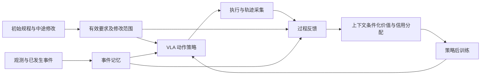

# 化学实验室 VLA 开题：动态规程与语言强化学习

> [!abstract] 本次收敛
> 用户确认：硕士刚开始开题；应用是化学实验室，优先研究**多步骤实验流程与操作中指令修改**；希望以语言与强化学习寻求突破，不以保留 MICA-VLA 架构为前提。建议主问题：**实验要求在执行中改变时，如何形成与当前有效规程一致的过程反馈，并用它改进 VLA 的动作策略？**

> [!info] 证据边界
> 2026-10-09 核查公开原始文献及作者项目页，读取当前 Linux 笔记库。下文方法、题目和实验均为候选方案，没有本项目实验结果，没有登录服务器或核验机器人。没有读取 MICA 全文，不能判断其架构强弱或已覆盖的创新点。沿用的是语言约束研究问题，不要求沿用旧架构。

关联：[[LingBot-VLA后续研究方向与四卡调试预算]]、[[VLA技术路线综述-从动作生成到世界模型与具身系统]]、[[MICA-VLA论文进展]]、[[RM65-B双臂机器人]]、[[VLA基座选择-InternVLA-A1.5、π0.5与GR00T N1.7]]。

## 1. 从化学实验室讲清楚研究故事

### 1.1 应用中的具体矛盾

化学实验操作对样品身份、顺序、工具使用历史和中途修改都有要求。仅检查最后“物体是否放进容器”，不足以区分整个操作过程是否符合规程。例如，最终摆放相同的两个回合，可能使用了不同样品、颠倒操作顺序，或复用了不允许复用的工具。这里研究的是**规程执行的可靠性与可修改性**，初期不承担化学发现、反应优化或任意实验设计。

已有工作已经推进了实验室 VLA 与长流程执行：RoboChemist 使用 VLM 规划、视觉目标和监测来组织 VLA；LabVLA 聚焦实验室数据与跨本体策略训练。因此，“把 VLA 用于化学实验室”“VLM 拆任务＋VLA 执行＋监测器”都不宜单独作为创新点。[RoboChemist](https://arxiv.org/abs/2509.08820)、[LabVLA](https://arxiv.org/abs/2606.13578)。

### 1.2 用一个贯穿开题的例子

以下为操作研究用的抽象规程，A/B/C 是样品标签，先用空容器、替代物或水验证：

初始要求：**“先处理样品 A，再处理样品 B；左手保持容器在指定区域，工具 T1 只用于 A，处理 B 时使用 T2。”**

完成 A 后、尚未处理 B 时，研究人员修改：**“后面的 B 改为 C，仍用 T2，其余要求不变。”**

机器人需要同时做到：

1. 将待处理对象 B 改为 C，停止执行已过时的后续动作。
2. 保留容器保持、工具专用等未取消的要求。
3. 记住 A 已完成，避免重复处理；保留工具使用记录。
4. 从当前物理状态继续，而不是把场景当成新回合。
5. 训练时区分“原先动作有误”和“用户改变了后续目标”。不能把修改前按原规程正确完成 A 的行为重新标成违反新指令。

先限定每回合一次更新、只修改未完成步骤、更新语义明确且物理可行。已经混合、转移或接触过的事实不能被一条新指令撤销；不可逆违规也不能因后来调整终点就消失。

### 1.3 可用于开题汇报的论证草稿

> 化学实验机器人需要执行的不仅是一个最终目标，还包括样品选择、操作顺序和工具使用等贯穿全过程的规程。研究人员在执行中修改某一步时，机器人需要根据已发生的操作调整后续行为，同时保持未被取消的要求。本课题拟研究如何将语言规程及其更新转化为可核查的过程反馈，并在强化学习中区分目标变化与执行错误，从而提升多步骤实验操作的规程遵循能力和修改后的继续执行能力。

这是研究计划表达，不是已经取得结果的论文摘要。适用于面向机器人学习的开题读者，论证按“应用矛盾→学习问题→候选方法→验证条件”组织。

## 2. 术语和研究对象：语言强化学习究竟更新什么

| 本笔记采用的术语 | 含义 | 需要区分的概念 |
| --- | --- | --- |
| 规程 | 本回合需要完成的操作及全过程要求 | 不等同于随时改写的提示词 |
| 规程修改 | 用户改变后续目标或约束，具有生效时刻与修改范围 | 不等同于为同一目标换一种说法 |
| 语言指导 | 在目标与约束不变时，提示执行办法或纠正动作 | 不应自行取消原规程 |
| 过程反馈 | 根据事件与历史评估进度、要求满足和违规 | 不等同于单帧视觉相似度 |
| 信用分配 | 确定回报应该怎样影响不同动作的学习 | 不等同于把一个终局分数广播给全部动作 |
| VLA 后训练 | 基于既有策略学习新的动作行为或改进已有行为 | 仅改提示词不证明动作策略已被训练 |

### 2.1 三条可以选择的语言与 RL 路线

| 路线 | 语言扮演什么角色 | 被学习的对象 | 适用情况与主要风险 | 本次建议 |
| --- | --- | --- | --- | --- |
| 规程条件化的动作 RL | 定义目标、约束及其更新；过程反馈用于价值估计与策略改进 | 动作策略及价值函数，可只更新必要参数 | 需要可靠事件判据；奖励和历史错误会被策略利用 | **主推**，直接对应用户选择的场景 |
| 保持规程一致的语言探索 | 给同一目标提供不同执行指导，帮助找到有效轨迹 | 动作策略；指导生成器可先冻结 | 容易通过悄悄简化要求获得更高分；PDE 已是直接近邻 | 主线有效后再扩展，或当独立备选 |
| 高层语言/技能决策 RL | 决定下一步操作、继续、回退或改计划 | 高层决策策略，低层 VLA 可冻结 | 成本可能较低，但效果受技能库限制，需胜过规则规划器 | 若底层技能已稳定可作为备选 |

如果“纠正语言→补录动作→仅做 SFT”，应称交互式模仿学习。只有反馈进入回报、价值或策略改进目标，才有本次所讨论的 RL 学习链路。冻结大部分 VLM、训练动作专家或适配器仍可以是 RL；是否全量更新与是否采用 RL 是两个不同问题。

不优先同时训练一个大语言规划器、一个大视觉奖励模型和一个全量 VLA。先明确真正的学习瓶颈，再增加需要训练的部分。

## 3. 主推切入点：动态规程下的过程评价与信用分配

### 3.1 科学问题与两个候选假设

**科学问题：语言要求发生中途修改后，如何让学习反馈与每段动作当时有效的要求一致，并让策略学会保留未修改要求、适应后续目标？**

**H1：规程条件化过程评价。** 在对象与终点相近的场景中，加入有效要求、已发生事件和规程修改语义，可以提高对“按规程成功、终点正确但过程违规、中途合法修改”的区分能力，并改善未见规程组合的执行表现。

**H2：修改语义条件化信用分配。** 在已提供相同规程状态与相同过程奖励的条件下，显式处理修改边界、仍有效要求和可比较的决策上下文，可以提高修改后合规完成率与交互效率，减少训练对已掌握前置行为的损害。

两者分别回答**“反馈评价的到底是什么”**和**“该反馈怎样改进哪些动作”**。H2 是更值得争取的方法核心。H1 的规程表示、事件记录或编译器本身可能只是标准工具与工程支撑；必须有学习或泛化上的新机制及证据，才能升格为独立创新。

### 3.2 最小表示与流程

可先将策略上下文表示为：

$$
x_t=(o_t,q_t,m_t,p_t), \qquad a_t\sim\pi_\theta(\cdot\mid x_t).
$$

- $o_t$：视觉与可用传感观测。
- $q_t$：机器人本体状态。
- $m_t$：任务事件记忆，例如已完成 A、工具 T1 已用于 A、左手保持要求仍有效；它不是完整视频缓存。
- $p_t$：当前有效规程及修改范围、生效时刻。训练可以记录版本编号，但策略与价值函数不能只凭一个任意编号泛化，必须获得相关内容与状态。

在部分可观测任务中，这个表示不自动构成完整 Markov 状态；只有事件与观测足以支撑判据时，才能使用相应状态假设。若状态由估计得到，要区分估计输入与仿真真值上界。

图只描述信息与学习流程，不要求增加一套大型主干。首版规程解析使用受限表达、人工校核或简单编译；可观测事件先采用明确判据。待这条学习链路有效后，再研究自动解析或视觉反馈泛化。

### 3.3 候选贡献一：与规程修改一致的过程反馈

**动机。** 终局 SR 不能覆盖顺序与工具历史；最后一条指令也不能代表整条轨迹每一时刻的有效要求。

**机制候选。** 将修改拆成替换、追加、解除，记录修改对象、生效边界和仍有效的要求。使用真实事件更新每条要求的状态；反馈分别报告有效步骤完成、持续要求满足、已发生违规及未完成义务，不让后来改目标清空历史事实。修改前按当时规程合规的操作保留该标签，修改后根据新规程评价后续操作。

**需要证明。** 在相同轨迹下改变合法规程时，评价能够响应真正的语义变化；只作同义改写时，评价保持一致；要求由工具历史决定时，评价能区别当前图像相同但历史不同的回合。再检查这些改进能否转化为动作学习收益。

这一部分应与 Reward Machines、ARM-FM、Logic-VLA 和规则监测器比较。**“语言转自动机”“历史相关奖励”“条件化约束编码”均已有基础，不能把它们重新命名就称为新方法。**

### 3.4 候选贡献二：修改边界下的信用分配

**动机。** 即使反馈正确，整轨迹一个分数、只按固定阶段分组，仍可能把不同有效要求与不同修改历史下的动作混在一起比较。新指令导致目标改变，也不等于上一条动作造成了失败。

**机制候选。** 价值函数显式获得有效规程、当前进度和必要历史；优势估计或局部轨迹比较按这些上下文组织。区别未修改义务、被替换的后续步骤及真实违规；在可控仿真中从相同事件前状态收集修改后的不同继续执行，检查信用是否集中到有差异的决策处。特别比较：常规 RL 已得到同一规程状态与反馈时，候选估计机制是否仍有收益。

**需要证明。** 在同样互动预算下，修改后更快找到合规继续执行；未修改要求不更易丢失；原先可靠的前置动作不因后续目标变化退化；收益不能由多采数据、多停顿或更频繁调用模型解释。

不能简单把修改点之前的全部回报/梯度设为零，也不能承诺“只更新某一步、其他能力绝不受影响”。前置动作可能影响后续可达性，共享参数也会产生跨阶段影响。若提出剔除外生目标变化影响的估计量，需要分析偏差并做受控实验；目前没有已确定的无偏公式或理论保证。

Temporal GRPO 已将优势限制到可检测阶段的对应动作区间；其正文注明对预定义线性阶段及可靠判据的依赖。应借此确定更具体的比较：**加入中途规程修改后，固定阶段比较需要怎样改变？** “更细粒度信用分配”本身已经不足以形成区别。[Temporal GRPO](https://arxiv.org/html/2608.13026v1)。

## 4. 两条备选突破路径

### 4.1 规程一致的语言探索

机器人反复失败时，可以通过语言指导改变执行策略，例如“先把容器放回支架再切换样品”，而非只在关节动作上加入噪声。已有 PDE 利用提示空间寻找更有效轨迹再做 RL，所以“语言指导探索”已不是空白。[PDE v4](https://arxiv.org/html/2607.08837v4)。

实验室的候选差异是：**探索提示允许改变办法，但不能私自改变样品、先后依赖或工具要求；用户明确改规程时才更新目标。** 将“目标/约束修改”与“同目标的执行指导”分开记录，探索提示的评分始终依据独立维护的有效规程。候选生成、筛选、探索预算和最终无额外指导的部署评测都需要控制。

这条路线的关键证据应是：相较 PDE、纯动作噪声和同量人为指导，在复杂规程下以更少交互找到合规轨迹，同时不靠简化目标刷高 SR。仅增加一个文本过滤器可能仍是工程扩展；需要验证对探索效率和语义保持的独立作用。

### 4.2 用环境回报训练高层语言/技能决策

若已经具有稳定低层技能，可把高层动作限定为“选择对象、选择下一技能、继续、暂停、返回支架、请求澄清”等，输出调用低层 VLA 所需的条件。用环境过程回报训练高层，而不是仅让 LLM 写看起来合理的计划。

优点是可以冻结低层，问题较容易检查；局限是不能凭高层语言修复低层不会的抓握、开盖或精密控制。必须与规则规划器、重规划器及冻结 VLA 的语言反馈策略比较。Learning What to Say to Your VLA 已研究对冻结 VLA 的闭环语言反馈，因此“VLM 给 VLA 反复提建议”本身也不新。[LFP](https://arxiv.org/abs/2606.12299)。

本次优先主线，不把两条备选同时列为必做创新。

## 5. 系统地构建创新点：从失败到可证伪假设

| 可复现的失败 | 研究问题 | 方法候选 | 必须击败的简单或近邻基线 | 假设不成立的迹象 |
| --- | --- | --- | --- | --- |
| 同终点、不同工具历史的轨迹都被判成功 | 过程评价能否识别规程意义上的差别？ | 规程与历史条件化反馈 | 仿真真值判据、规则监测器、文本条件奖励模型 | 规则反馈同样解决，学习部分没有泛化增益 |
| 修改 B 后丢失未取消的容器保持要求 | 哪些要求继续有效？ | 有范围与生效边界的规程更新 | 完整更新提示、阶段状态提示、SwitchVLA 的受控改编 | 全量提示刷新和清队列已解决，新增表示无额外作用 |
| 修改后一次失败让已掌握 A 的执行退化 | 哪些动作应受当前反馈影响？ | 规程/进度条件化价值与局部比较 | 同反馈常规 RL、Temporal GRPO 改编、StructRL | 所有收益来自阶段奖励或额外输入，信用机制消融无影响 |
| 语言指导把规程简化，SR 提升但操作不合规 | 探索指导怎样保持实验目标？ | 独立规程评价下的指导探索 | PDE、等量人工指导、约束过滤＋普通 RL | 过滤器即可解释全部收益，或去指导评测后收益消失 |

建议贡献结构：**一个核心问题→过程反馈研究→信用分配研究→化学操作验证**。评测协议和数据集提供证据，不因新增任务数量就自动成为第三个算法创新。

开题中使用“拟研究”“候选假设”“待验证差异”，避免先承诺两个已成立创新点。方法名应在机制明确且消融有效后再定；不要先命名新 VLA 再填模块。

## 6. 最小实验设计与验收

### 6.1 三类实验逐层增加困难

1. **静态多步骤规程**：对象身份、工具使用与顺序要求；先测底层技能和反馈是否可靠。
2. **一次中途修改**：替换一个未完成步骤，其余要求保持；这是主实验。
3. **未见修改组合**：把对象/阶段/修改类型组合留出；加入同义表达检查语义泛化。

建议先用 3–5 个任务模板、少量可重复的原子动作，在成功、过程违规、合法修改与不可行修改之间明确标签。液体仿真未验证前，可先研究管架取放、样品流程、工具交换与容器保持；不要把抽象物体操作直接称作真实化学液体动力学验证。

### 6.2 基线顺序

| 层级 | 对照方法 | 回答什么 |
| --- | --- | --- |
| 基础 | 同一 checkpoint 的 SFT、同量新增数据 SFT | 是否只是更多示范带来的收益？ |
| 执行系统 | 最新完整指令＋相同队列刷新；规则阶段控制/有限状态机＋VLA | 简单执行控制能否解决问题？ |
| 反馈 | 同事件判据的阶段奖励、规程状态＋常规 RL | 是否只因获得更多奖励和状态信息？ |
| 信用 | Temporal GRPO、StructRL 的兼容改编 | 是否胜过已有局部信用/依赖奖励？ |
| 任务切换 | SwitchVLA 的兼容改编 | 差异是否仅为中途换目标？ |
| 可选探索 | PDE 与等量人工语言指导 | 是否提升合规探索效率并转移到正常部署？ |

不能宣称这些方法已适配 LingBot 或 RM65。直接复现、受控改编、仅思想基线必须分开标注；使用相同底层策略、判据与输入预算，避免把不同模型能力误认为算法收益。

### 6.3 关键指标

- **合规完成率**：完成当前有效任务、且各段动作符合当时生效要求的回合占全部有效回合的比例；主指标。
- **修改后成功率、未修改要求保持率**：分别衡量适应新目标和保留原要求。
- **交互效率**：达到预定合规完成水平所需环境动作数、回合数及人类参与时间；不同流程长度不能只比回合数。
- **响应延迟、总耗时、重试次数**：无响应记失败，防止通过长时间暂停或无限重试取得漂亮分数。
- **学习前后前置技能表现**：检查局部策略改进是否伤害共用能力。
- **反馈正确性**：有效要求识别、事件判断和违规漏报；用于定位奖励错误与策略错误。

固定初始布局、随机种子、更新事件前状态和历史；在该状态上比较不同后续指令。训练、人工指导、奖励模型和数据生成的所有阶段都要遵守测试组合留出。分别报告已见、未见组合和同义改写；报告样本数、不确定性与多个训练种子。

不可行修改可作为单独诊断集合，期望正确指出不可行或进入定义好的恢复流程，不把“无法按新目标成功”混成底层控制失误。主结果先排除不可行要求。

## 7. 基座、RL 算法和观测边界

**一个主基座。** 先选能稳定完成 SFT 与 rollout 的模型。现有 LingBot 积累可复用，但本次没有确认其 RL 接口或闭环；π0.5 可作为已有文献与开源实现较多的候选。框架选择服务于实验，先不承担多个基座全部重训。

**连续动作不能直接套文本 GRPO。** LingBot/π 系列的 flow-matching 动作头，不能把去噪 MSE 当成精确动作 log-probability 填进 PPO。RECAP 提供价值估计与优势条件化的 VLA 后训练路线；如使用已有 PPO/GRPO 的连续动作实现，需核对其采样策略、密度估计或替代目标。算法适配属于依赖核查，尚未实际运行。[RECAP](https://arxiv.org/html/2511.14759v2)。

**真实 RL 与偏好后训练区分。** Logic-VLA 的轨迹偏好优化可作为比较或低成本先导，但离线满足/违反轨迹配对不等于完成在线环境 RL。若学习主线采用优势条件化，也要说明价值监督、回报与策略提取如何构成策略改进，不能只说“加一个 positive token”。

**交互条件必须记录。** 中途替换语言后收集的动作，有它实际使用的语言与行为策略。不能将所有轨迹随意改写成最终指令后，当成标准 on-policy 数据直接计算 PPO 比率。离线重标记需要重新计算一致的规程状态与奖励，并采用相应离线/离策略算法；反事实奖励评测也不等于真实采到了另一条可行执行。

**观测可核查。** 样品身份优先来自标签/条码与库存记录；工具专用来自使用事件历史。相机不能直接证明透明液体的成分或隐性污染；微量转移误差需要称重、电子移液器记录等实际测量依据。尚未配备的传感器不作为已有能力。头部相机、腕部相机、标定与灵巧手接口的当前状态，以 [[RM65-B双臂机器人]] 为入口，引用其原核验日期，本次没有复核。

**先分离感知与学习问题。** 首个 RL 实验使用可靠的仿真事件判据；第二步加入部署可用的事件估计。分别报告真值上界与真实观测输入，禁止在测试时偷偷用模拟器隐藏状态后称为真机可部署。

## 8. 近邻工作与创新边界（核查：2026-10-09）

本表用于选题定位，不是逐篇精读或复现报告。全文仅定向查看相关方法/局限段落；未运行其代码。

| 工作与本次版本 | 已有贡献 | 本课题必须说明的差异 | 发表状态依据 |
| --- | --- | --- | --- |
| [RoboChemist](https://arxiv.org/abs/2509.08820), v1 | 化学长流程、VLM/VLA 双环与规程监测 | 从运行时规划监测推进到学习反馈与策略后训练，而非仅换场景 | arXiv 与作者项目页标注 CoRL 2025 |
| [LabVLA](https://arxiv.org/abs/2606.13578), v2 | 实验室仿真数据引擎、FAST 预训练与连续动作后训练 | 动态规程学习不应混成又一次实验室基座训练 | arXiv 注明 work in progress |
| [Text2Reward](https://proceedings.iclr.cc/paper_files/paper/2024/hash/9941833e8327910ef25daeb9005e4748-Abstract-Conference.html) | 自然语言生成可执行稠密奖励，并据反馈迭代 | 自动写奖励代码本身已有研究 | ICLR 2024 官方论文集 |
| [RoboReward](https://arxiv.org/abs/2601.00675), v2 | 视觉语言奖励模型、反事实重标记与近似失败数据 | 换文字构造负例不新；需研究全过程与修改一致性 | 本次按预印本定位，未独立核定录用 |
| [Reward Machines](https://arxiv.org/abs/2010.03950) 与 [ARM-FM](https://arxiv.org/abs/2510.14176) | 暴露奖励结构、时序与历史奖励、自动语言规约及组合 RL | 不能将自动机、语义状态和语言奖励生成本身当新机制 | 原始作者论文，正式状态未在本次逐项核定 |
| [Logic-VLA](https://arxiv.org/abs/2608.20556), v1 | STL 条件化、满足轨迹 SFT 与轨迹偏好优化 | 动态修改后的评价与信用，需要区别于固定规约条件化 | 本次按预印本；四旋翼仿真 |
| [Temporal GRPO](https://arxiv.org/html/2608.13026v1), v1 | 按可检测阶段比较轨迹并局部赋予优势；注明线性阶段限制 | 更新语义、仍有效义务与修改后可比较上下文 | 本次按预印本 |
| [StructRL](https://arxiv.org/abs/2609.36352), v1 | 可核查子任务奖励、前提依赖门控和完成节奏 | 添加阶段奖励与依赖顺序不足以区分 | 2026-09-28 预印本 |
| [SwitchVLA](https://arxiv.org/abs/2506.03574), v1 | 执行状态与指令条件化的任务切换 | 切换后持续规程及学习反馈，不只快速响应 | 本次未独立核定正式录用 |
| [PDE](https://arxiv.org/html/2607.08837v4), v4 | 以提示空间探索有效轨迹并优化 VLA；任务回报独立于探索提示 | 必须区别实际改规程与不改目标的指导，并保持过程要求 | 作者主页标注 NeurIPS 2026 已录用；未查正式论文集 |
| [Learning What to Say to Your VLA](https://arxiv.org/abs/2606.12299), v1 | 对冻结 VLA 搜索、蒸馏闭环语言反馈并评估干预收益 | 训练动作策略与价值，还是只训练外部指导策略，需明确 | 本次按预印本 |
| [RECAP](https://arxiv.org/abs/2511.14759), v2 | 混合示范、自主轨迹与人工干预的价值/优势条件化改进 | 作为算法路线参照；动态规程信用不是该论文结论 | 本次按技术论文；作者报告真机实验 |

检索没有发现与本候选问题完全一致的证据，不等于已经证明首创。尤其需要继续追踪动态任务、奖励修改、Reward Machines 与语言干预 RL 文献。候选假设应在实施前与导师及最近工作全文核对。

## 9. 对此前开题建议的修正与计划

此前 [[LingBot-VLA后续研究方向与四卡调试预算#硕士开题方向与范围（2026-10-09）]] 将 RL 作为可选增强。本次用户新增化学场景与明确偏好后，**RL 改为主线，持续约束与增量修改成为 RL 的问题定义**。MICA 保留为历史积累，不默认保留其网络设计。

候选题目：**《面向动态实验规程的视觉语言动作模型强化学习方法研究》**。如果学院更强调应用，可用 **《面向化学实验操作的语言规程驱动机器人强化学习方法研究》**。题目均为建议，尚未经导师确认。

| 建议阶段 | 交付与验收 | 调整条件 |
| --- | --- | --- |
| 第 1–2 周 | 精读 RoboChemist、PDE、Temporal GRPO、StructRL；跑通一个基座与可靠事件反馈；确定一类可行更新 | 底层技能尚不稳定时，先建立能继续执行的初始策略 |
| 第 3–4 周 | 固定事件前历史的失败诊断；完整提示刷新、规则控制、同奖励常规 RL 对照 | 若简单方法已解决，重新定位信用分配的必要性 |
| 第 5–6 周 | 真值反馈下比较候选信用机制；等交互预算、去历史、去修改语义消融 | 反馈正确但信用机制无额外收益时，不强行增加网络 |
| 第 7–8 周 | 未见修改组合；少量真机替代物流程；报告感知/控制边界 | 真机迁移未完成时报告仿真证据，不等同于化学实验部署 |

不预设获得某个成功率或论文等级。八周是建议先导窗口，不是实际学位截止时间。语言指导探索与高层决策 RL 暂作备选，不同时承诺。

## 下一步

- [ ] 与导师确认化学操作范畴、可使用的器具及可测规程。
- [ ] 按失败机制精读四篇直接近邻，逐项核对修改语义与信用估计是否已覆盖。
- [ ] 用一个主基座、可靠判据和一个可行修改跑通 SFT→采集→回报/价值→策略改进→独立评测。
- [ ] 证明简单规则与同量 SFT 仍有缺口，再决定新的反馈与信用机制。
- [ ] 先用空容器/替代物与少量稳定抓握构建样品/工具流程，测量当前观测能支持哪些标签。
