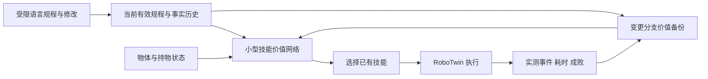

# 硕士开题建议：中途规程修改下的技能恢复与价值学习

> [!abstract] 本次选定的建议
> **建议题目：面向实验规程中途修改的机器人技能恢复决策与强化学习。** 聚焦已抓起旧目标、但该步骤尚未完成时，怎样选择放回、暂存、换手或接续，让修改后的整个流程合规完成且代价较低。先冻结低层原语，仅学习小型技能价值函数；不同时研究自由语言解析、液体动力学、世界模型和全量 VLA 后训练。这是方向建议，尚不代表用户已经确定题目。

> [!important] 算法新颖性边界
> 候选方法为“历史一致的规程变更分支价值备份”：在同一真实物理转移上枚举少量合法修改分支，以正确概率加权后续价值。**反事实复用、期望备份及自动机不是新思想**，CRM/QRM 与相关 TD 理论已覆盖其通用基础。当前可以明确提出机制、条件与实验，不能宣称已成立的首创算法。若将动态修改加入扩展 RM 后，标准 CRM＋期望备份就能完全复现候选方法，则方法应归为该框架的应用/扩展，不能靠名称包装成独立算法创新。

关联：[[强化学习优势的数学本质-从序贯决策到具身选题]]、[[化学实验室VLA开题-动态规程与语言强化学习]]、[[目标语义保持空间精化-RL算法定义与RoboTwin最小验证]]、[[RoboTwin 2.0框架与默认任务]]。

## 1. 一个具体任务贯穿开题

原规程：先把药瓶 A 放到红垫，再把 B 放到蓝垫，最后把未使用药瓶留在原区、双臂回位。已完成的 A 不重复处理，瓶体不可倒下。

在 B 已被抓起、尚未放到蓝垫时，用户修改：**“后面的 B 改成 C，其余要求不变。”**

机器人已持有 B，物理状态不能随改指令重置。可选路径包括：

- 放回 B 后抓 C；
- 暂存 B、先处理 C，再归还 B；
- 保持 B，用空闲手处理 C，再归还 B；
- 必要时经过中间暂存/重抓，改变持物手与通路。

不同布局下，最近暂存点可能阻挡 C 或占用之后的操作区域；放回 B 较慢却可能提高后续成功率。需要至少两次依赖前次执行结果的技能选择，避免把问题退化成一次选择后立即评分的 contextual bandit。

首版只允许每回合一次明确修改，修改未完成步骤的对象或目的地；在原子技能结束处生效。例如抓取结束仍在持物状态，这属于多步骤流程中途修改，但不声称支持控制周期内打断轨迹。已经完成或不可逆发生的事实不能被撤销。

这里模拟的是实验室样品物流、身份与操作顺序，不是化学反应、液体计量或真实污染动力学。工具接触历史可日后扩展，初版不同时加入。

## 2. 为什么值得考虑 RL，什么情况下不用 RL

| 方法 | 能解决什么 | 本题需要检验的不足 | 必须承认的边界 |
| --- | --- | --- | --- |
| 最新指令刷新＋规则重规划 | 正确目标替换、固定恢复顺序 | 不同物理状态下，固定恢复路径的长期代价/成功率是否不同 | 若简单规则已解决，则 RL 主线必要性不足 |
| 监督学习/行为克隆 | 从示范学习恢复动作或技能选择 | 当前持物与未见修改组合缺少覆盖；最优恢复动作比最终结果更难标注 | 等成本 DAgger/纠正示范可能同样有效，不能宣称监督无法解决 |
| 符号/几何规划 | 已知前置条件、无碰撞路径与任务顺序 | 未知的技能执行后果、稳定性和状态相关成功概率不由逻辑合法性自动给出 | 若模型可靠，规划可以直接求解，RL 无原则性优势 |
| 学习技能模型＋期望搜索 | 从同样数据估计技能成功/耗时再重规划 | 模型误差、组合搜索成本与有限交互下的效果 | 属于重要强基线，也可视为 model-based RL；不能只比较弱规划器 |
| 技能级 RL | 用实际结果学习现在选择对后续合规成功的影响 | 反馈、覆盖、复位是否足够；是否真正存在多步权衡 | 无法凭空学出低层不会的技能，不保证比以上方法省样本 |

本题的 RL 依据是 **结果评价较便宜、恢复路径难逐步标注、动作改变后续可操作性且执行后果未知**。语言修改本身不是依据。也不预设规划或监督“原则上不够”。

## 3. 只训练哪一部分

首版规则解析固定表达，输出对象、目的地、修改范围。解析器不计为算法贡献，所有方法共用。

状态 $x=(z,h,p,k)$：

- $z$：物理状态；机制诊断先用仿真真值，实际低维输入可包含位姿、速度、关节、持物手及区域占用。
- $h$：事实历史与必要事件，例如 A 已完成、B 被哪只手持有、过去是否发生不可逆违规。
- $p$：当前有效规程及仍需完成的要求，不能只有一个任意版本编号。
- $k$：时间/技能预算、是否已发生本回合唯一修改。

理论以充分状态为条件。简化位姿与持物编码不自动满足 Markov 性；状态估计/历史不足时需要补充，而不能把理论保证直接套给压缩输入。

动作 $u$ 是一个**参数已固定的技能**，例如左手抓 C、把左手所持 B 放回原区、把 B 放到左暂存点。初版每个状态保留约 6–10 个可执行候选；这是候选目标，不是现有官方接口数量。动作掩码只处理共同前置条件，不能给新方法额外 oracle 恢复答案。

普通基线用小型 DQN/Double DQN。低维输入时，两层 128 或 256 的 MLP 通常为万到十万量级参数；具体参数量随输入/候选数计算，不是 VLA 的数十亿参数。首版离散动作不需要对 flow-matching VLA 求动作 log-probability。

低层先用 RoboTwin 规划原语。高层机制通过后，再替换为冻结且已验证可靠的 VLA 技能。规划原语结果不能直接称为 VLA RL 后训练结果；接入冻结 VLA 也不表示其权重被 RL 更新。

## 4. 一个核心算法候选：历史一致的变更分支价值备份

### 4.1 分开物理结果与规程更新

一次固定技能得到真实结果 $\xi=(z',e,d)$：下一物理状态、事件和持续时间。先根据执行时有效的 $p$ 评价这一段动作，累计折扣奖励为 $R$；更新事实历史 $h'=\operatorname{append}(h,e)$。

随后在技能边界接受编辑 $c$，包括“无修改”。将其作用于**剩余要求**：

$$
p'_c=\operatorname{Edit}(p,h',c),
\qquad x'_c=(z',h',p'_c,k'_c).
$$

不能修改 $z'$、擦除真实历史或把旧动作追溯改成在新规程下执行。若保留完成位，需要按事实和生效边界计算残余任务状态，而非简单清零全部进度。

物理结果共享的条件是：给定充分物理状态与参数固定的技能，编辑在技能完成后生效；编辑不会改变该段已执行的动作、动力学、对象或传感器。若动作定义为“完成当前目标”而实际轨迹随编辑变化，则不能将其当成同一 $u$ 复用。

### 4.2 从采样一次修改，改为对合法分支求条件期望

训练环境公布合法编辑集合 $\mathcal C(x,\xi)$ 与分布 $q(c\mid x,u,\xi)$。它可以包含依据事件触发的规则，但只能使用真实可获得的条件；首版分布由实验协议给定，不推断真实研究人员意图。

普通采样目标：

$$
Y_{\rm sample}=R+\Gamma(d)(1-D_c)\bar V(x'_c),
\qquad c\sim q.
$$

其中 $D_c$ 为相应分支的终止标记，$\Gamma(d)$ 是技能时长对应折扣，$\bar V(x)=\max_u Q_{\bar\theta}(x,u)$；Double DQN 可替换为在线选择、目标网络评价。奖励 $R$ 必须与这个时间折扣约定一致。

候选目标：

$$
Y_{\rm branch}=R+\Gamma(d)
\sum_{c\in\mathcal C}
q(c\mid x,u,\xi)(1-D_c)\bar V(x'_c).
$$

用 MSE 训练 $Q_\theta(x,u)$，目标停止梯度。当前技能执行时只有当时有效的要求；将未来编辑边缘化，不是把最新目标追溯到当前动作的即时奖励。

首版只改变这个备份算子，先不额外重标当前规程或添加多个损失。一个真实物理结果多算几次小网络前向，无需复制仿真分支、重放整段接触或训练世界模型。**虚拟编辑只能给出下一规程状态，不能制造未执行技能的物理结果，也不能替代探索。**

部署用当前观测到的规程选择技能，不提前看到实际未来消息。训练知道的是总体编辑分布；部署分布改变会影响价值，需单独测量。

### 4.3 可核查的数学性质

固定当前 $x,u$ 和目标网络、编辑分布正确、分支有效时：

$$
Y_{\rm branch}=E[Y_{\rm sample}\mid\xi],
\quad E[Y_{\rm branch}]=E[Y_{\rm sample}],
$$

$$
\operatorname{Var}(Y_{\rm sample})
=\operatorname{Var}(Y_{\rm branch})
+E[\operatorname{Var}(Y_{\rm sample}\mid\xi)].
$$

因此消除的是**给定相同物理结果后，随机指令修改造成的目标方差**。没有删掉前置动作对后续可恢复性的真实影响，也没有保证网络收敛或最终 SR 更高。这是条件期望/全方差公式的应用，不是新数学定理。

若所有编辑只有一个分支，或各分支后续价值相同，该项收益为零。若广泛备份到未覆盖的分支，critic 初值/外推误差可能抵消低方差收益；相关风险在 Adaptive Tree Backup 文献中已有分析，不能只看方差就断言更快。

若采用估计分布 $\hat q$，令分支值 $W_c=(1-D_c)\bar V(x'_c)$ 位于 $[W_{\min},W_{\max}]$，则本次自行推导：

$$
|Y_{\hat q}-Y_q|
\le\Gamma(d)(W_{\max}-W_{\min})
\operatorname{TV}(\hat q,q).
$$

这说明错误编辑分布会引入偏差；不是真实用户修改分布已知的证明。只允许枚举所有合法分支再正确归一化，不能删除困难分支后仍声称优化原分布。

## 5. 真正需要争取的贡献与近邻

拟研究的是：**部分规程修改下，能否构造保持真实历史、义务生效边界与目标分布的技能价值更新，以更少真实交互学会合规恢复？**

| 近邻 | 已覆盖的内容 | 本题必须检验的额外内容 |
| --- | --- | --- |
| CRM/QRM，JAIR 2022 | 同一物理转移用于多个 RM 状态的反事实学习 | 动态编辑如何映射保留事实的残余规程；显式编辑转移是否带来区别，还是直接被扩展 RM 吸收 |
| Expected/Tree Backup、ATB | 样本与期望备份、方差和覆盖的权衡 | 本题的外生编辑分支及适用条件；不能宣称发明期望备份 |
| HER、LfH | 以其他/已实现目标重标轨迹 | 当前方法保留原事实与真实目标生效时刻；不能把错目标当本任务成功，相关方法仍应是经验利用基线 |
| Successor Features/GPI | 奖励结构复用与任务转移 | 残余规程与历史条件化要求不一定是固定状态特征上的简单线性权重变化；不能笼统称换目标价值复用首创 |
| SwitchVLA | 执行状态条件化前进/回退/切换 | 本题学习恢复路径的长期价值与交互效率；“支持改指令”已有工作 |
| Temporal GRPO | 按可检测阶段比较轨迹并分配局部信用 | 本题将编辑转移纳入价值备份，而非仅划段；其离散高层适配需明确是 adapted baseline |
| StructRL（2609.36352） | 前置依赖与节奏条件的阶段奖励 | 所有对照共用过程判据，方法收益必须来自更新机制而非更多奖励 |
| CCA，ICML 2021 | 用满足独立条件的未来信息构造信用估计 | “外生变化不是动作错误”的一般信用思想也已有基础，不宣称首创该解释 |

注意有两篇同名 StructRL：本表指 **Online Structured Reinforcement Learning for Long-Horizon VLA Tasks，2609.36352**，不是动作空间结构化噪声论文 2608.15139。

截至本次核查，没有证据证明候选超过已有方法。最重要的反证是：**等预算扩展 RM＋CRM＋相同期望备份完全解释全部收益。** 如发生，应将其归为清晰的应用研究或重新寻找算法问题，不能继续叫新算法。

“一个规程解析器＋DQN”“修改前梯度全部归零”“新增语义奖励”“增加双 critic”“只更新最新子任务”均不作为本题创新。

## 6. RoboTwin 最小验证及本地接口依据

### 6.1 当前源码核查

本地根目录 `/home/admin123/liminghe/vla-benchmark/RoboTwin`，2026-10-10 静态读取；该工程没有 `.codegraph/`，按约定使用普通源码读取，未自行索引。

| 当前文件 | 已读到的可复用内容 | 边界 |
| --- | --- | --- |
| `envs/move_pillbottle_pad.py` | 药瓶 `080_pillbottle`、目标垫、抓取—抬起—放置原语 | 默认一瓶一垫、固定整回合，不是动态规程场景 |
| `envs/pick_dual_bottles.py` | 双瓶生成、双臂分别抓取 | 原任务成功定义不能替代完整新规程 |
| `envs/handover_block.py` | 换手/交接动作示例 | 对药瓶的交接未验证，首轮可以不加入 |
| `envs/_base_task.py` | `grasp_actor`、`place_actor`、`move`、`get_obs`、`set_instruction` | `set_instruction` 仅改字段；不会自动清动作缓存或建立 RL 奖励 |
| `scripts/eval_policy_xpolicylab.py` | 按 chunk 逐动作执行，依赖 `eval_success` 和步数结束 | 动态修改需清旧 chunk；不能沿用单步任务提前终止逻辑 |

虽然 Base_Task 继承 gym.Env，当前任务代码使用 setup/play_once/take_action 风格；本研究仍需独立技能级 reset/step wrapper 与过程奖励，不能认为已是即插即用的标准 RL 环境。本次未系统审计所有 XPolicyLab RL 工具，也不声称整个项目没有 RL 支持。

`move` 的规划失败会把 `plan_success` 置为假，后续原语可能直接跳过。首版将规划失败记录为真实失败并结束回合，不随意清标记假装恢复；若研究失败后的原地重规划，需要另外实现并验证安全恢复。

### 6.2 只改一个场景

从药瓶取放派生独立研究任务：三药瓶 A/B/C，红蓝目标垫与一个可变暂存区域。先用官方常用 Aloha 双臂与夹爪；已有 RM65-B 灵巧手接入不作为这一机制验证的依赖。

每回合 4–8 个技能决策，最多一次对象替换或目标垫替换。初版编辑在抓取/放置原语返回后处理，不做控制周期内中断。手中有旧物、暂存区占用及剩余预算必须进入状态。

用真实几何/接触执行造成的差别评价策略。若原语在全部布局下确定且无代价差别，规则已能解决，应如实停止该假设；不为证明 RL 优势而人为给正确规则添加随机失败。

事件奖励：完整有效规程合规成功、真实不可逆违规、真实耗时/技能次数。先不要学习 VLM 奖励模型。若加阶段完成奖励，所有基线使用相同判据及相同数值；目标改变本身不发失败惩罚，历史违规不因改目标擦除。

### 6.3 对照分两层

**A. RL 是否值得用：** 最新指令＋固定放回规则；符号/几何重规划；同样物理轨迹训练技能成功/耗时模型＋有限层期望搜索；等专家时间的 BC/DAgger；同规程状态、奖励和技能的普通 DQN/Double DQN。

**B. 算法候选是否有效：**

1. 普通采样备份；
2. 动态规程状态＋CRM 经验复用，编辑仍采样；
3. 仅变更分支备份；
4. 扩展 RM＋CRM＋期望备份的完整组合；
5. 同状态与奖励的阶段信用方法适配，用于说明不是已有局部信用的重命名。

第 4 项可能与候选本质等价，必须正面检查。直接复现所有大 VLA 近邻不是先导实验必需；阶段奖励/信用的离散适配需要标明，并不能冒充原论文严格复现。

控制同一技能库、可见状态、解析器、候选掩码、事件奖励、真实交互次数、重置与模型选择预算。方法额外前向、更新次数与墙钟时间单独报告。虚拟分支不计成额外真实环境样本，也不宣称获得免费未执行动作反馈。

### 6.4 评价和可证伪假设

- 修改后完整合规 SR，以及未修改要求的保持率；
- 修改到完成的真实耗时、额外技能次数、恢复失败率；
- 随真实物理交互次数变化的学习曲线；
- 固定同一 Q checkpoint 和物理转移，枚举合法编辑后测目标方差与均值，验证数学机制；
- 变更频率为零/低/高、时机变化、未见对象—目的地组合、编辑分布偏移；
- 无修改任务是否退化，以及错误规程重标带来的目标偏差。

**H1：** 在存在后续可操作性权衡的布局中，技能级 RL 比固定恢复和同预算监督更有效；模型学习＋规划作为强反证基线。

**H2：** 编辑分布正确时，候选与采样目标均值一致、目标方差更低；价值分支相同或无修改时该收益消失。

**H3：** 在同样状态、反馈、真实交互和计算报告下，低方差能转化为更快学习，而非只是拟合一个较平滑的目标。

H2 是标准条件期望性质的应用；H1/H3 必须实验。只有 SR 提升且没有机制检验，不足以建立算法贡献。

## 7. 工作量与停止条件

| 阶段 | 最小工作 | 验收依据 |
| --- | --- | --- |
| 先导 1 | 一个场景、技能封装、明确编辑与事件协议 | 原子技能成功率/耗时及失败归因；证明存在两条恢复路径的后果差别 |
| 先导 2 | 小型 DQN 基线、规则/规划/监督对照 | RL 必要性是否成立，技能失败是否掩盖高层决策 |
| 先导 3 | 更换一个 TD 目标、分支合法性与均值/方差检验 | 无错误历史重标、无真实未来消息泄漏；正确分布下等均值 |
| 后续 | 多种布局/修改组合、冻结 VLA 替换原语、RM65-B 验证 | 先分别验证技能成功，再验证高层效用；不混淆底层与方法收益 |

建议先用每方法数百回合筛查，再按每次技能执行计真实交互，选择是否扩展至数千次技能、三个训练种子及独立评测布局。数目是预算建议，不是已运行配置或足够收敛的保证。

若原语已可靠，先导可按 2–3 周安排；这是工作计划估计，实际耗时取决于复位、规划与场景构建，不承诺训练时长。新工作主要是一个任务文件、技能级 wrapper、规程/事件管理、训练目标和评测统计；不必先改 6B 主干或训练液体世界模型。

停止或收缩条件：规则已接近上界；同预算模型规划更好且没有明确学习收益；监督纠正更便宜有效；分支目标方差并非瓶颈；扩展 CRM 完全等价；底层技能不可靠。不能通过降低基线信息或抬高近邻复现成本来保留创新叙事。

## 8. 可用于开题的简短表述

> 本课题面向实验规程在执行中发生部分修改的场景，研究机器人如何利用已发生的操作事实与当前物理状态，选择合规且低代价的恢复技能序列。拟在冻结低层技能的基础上，通过执行反馈学习恢复决策的长期价值，并研究利用规程修改结构构造历史一致的价值备份，减少外生指令变化带来的学习目标方差。通过受控双臂仿真比较规则、监督、模型规划与现有强化学习方法，检验其交互效率及适用边界。

以上为研究计划，不是成果摘要。可以先按题目开题，方法名称与首创性须在近邻等价性检查和先导证据后确定。

## 9. 本次证据范围

2026-10-10：读取已有笔记、核查上述原始论文的相关方法/摘要与本地任务、执行入口；数学等式和 TV 界为本次自行整理推导。CRM、ATB、CCA 为已发表基础；SwitchVLA、Temporal GRPO、StructRL、LfH 的此处依据是所链接作者预印本，不推断其顶会接受状态。

本次没有实现新任务、训练策略、运行仿真或连接真机，没有使用服务器资源。尚未获得 SR、时间收益或新颖性成立的项目证据。
