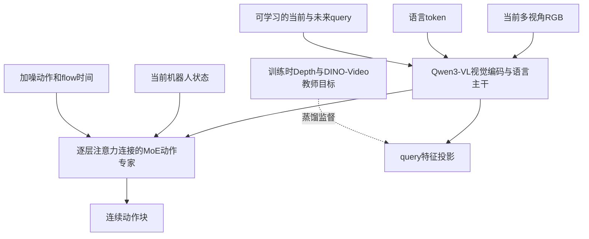

# LingBot-VLA2与π0、SmolVLA架构比较

比较对象为原始 π0、原始 SmolVLA 论文，以及本地 LingBot v2 commit `ecca77bb259b9592d5fc0eb2b4972d4a236ed2c8` 的 RoboTwin 默认后训练配置。不混入 π0.5、后续 RTC 扩展或所有 LeRobot 版本的可选项。

## 共同骨架

三者都基于视觉语言条件生成连续动作块，采用 flow matching；因此“连续动作、50 步动作块、语言条件控制”不是 LingBot 2.0 首创。三者都不应被简化成“LLM 直接逐字输出关节角”。

| 结构或接口 | π0 原始方案 | SmolVLA 原始方案 | LingBot-VLA 2.0 当前代码 |
| --- | --- | --- | --- |
| 骨干 | PaliGemma 3B | SmolVLM2，截取前16层以降低成本 | Qwen3-VL-4B-Instruct |
| 动作专家 | 约300M的独立动作参数分支 | 小型动作专家，交替 cross-attention 和 causal self-attention | 36层动作专家，FFN替换为稀疏MoE |
| 主模型规模 | 论文约3.3B | 论文主模型450M，常见发布称0.5B | 发布名6B；总参数不等于每token激活参数 |
| 状态接入 | 动作侧投影 | 投影为token，进入VLM | 动作侧state_proj |
| 主控制输出 | 连续动作块，语义由本体映射决定 | 连续动作块，语义由数据决定 | 统一55维表示，默认RoboTwin映射成14维关节/夹爪目标 |
| 几何与未来辅助学习 | 原始方案不含这里的双教师双query设计 | 原始方案不含这里的设计 | 当前/未来query对齐Depth及DINO-Video特征 |

## LingBot 2.0 的实际信息流

这是信息流示意，VLM 与动作分支不是仅在最后一层串接。源码 `QwenvlWithExpertV2Model.forward` 将两个分支各层的 Q/K/V 按 token 维拼接，结合 attention mask 计算，再回到各自参数分支。动作侧读取视觉语言条件；推理可缓存本次前缀的 KV，供多次 flow 更新复用。

## 主要结构变化

1. **视觉语言主干替换**：Qwen3-VL-4B，代码接入视觉边界、位置编码和 DeepStack 视觉特征。不是新增一个专门把任务拆成文字步骤的规划器。
2. **动作FFN的稀疏MoE**：默认36层、每层32个路由专家、每token选4个并加共享专家。主旨是在有限激活计算下容纳更多跨本体/任务模式；专家没有固定命名为“抓取、开门、RM65”等技能模块。
3. **双query双教师蒸馏**：学习当前与未来查询表示，用 LingBot-Depth 几何特征和 DINO-Video 时序特征监督。当前RoboTwin配置每组query使用8个task tokens；论文图中两个query符号不必等于实现中总共只有两个token。
4. **55维统一动作布局**：手臂14、末端位姿14、夹爪2、手12、腰4、头2、底盘3、预留4。输入输出维度在机器人映射后用mask管理，并非要求每台机器人拥有全部自由度。

π0 的 VLM/动作两组参数有时也被称为专家或MoE；需要区分“按模态分配参数的分支”和 LingBot 动作FFN内部每token top-k 路由，不能仅按名称认为是同一机制。

## 输入输出上的实际变化

默认部署仍只需要当前 RGB、语言、状态，不需要未来相机画面，也不必输入 D435 实测深度。深度教师和未来画面用于训练监督；推理保留学到的query表示，而不是在线启动教师观察未来。

默认控制输出仍是动作块。新增的是训练内部的当前/未来特征预测目标及更广的本体表示，不是对外必须输出“未来视频＋文字计划＋动作”。应避免把 LingBot-VLA 2.0 和 LingBot-VA 视频动作模型混淆。

RoboTwin映射使用绝对关节角与夹爪位置，不映射EEF位姿。模型支持EEF字段，不表示每次同时有效预测关节角和末端位姿，也不表示6轴灵巧手平台已经可以直接部署。

## 训练与部署差异不能混当结构提升

- π0 原始路线本身已支持跨机器人；SmolVLA定位于低成本高效率。LingBot并非在每个维度都比它们更优，尤其参数、显存与训练成本不等价。
- SmolVLA论文主实验冻结VLM、训练动作专家；LingBot当前RoboTwin YAML默认训练主策略全部模块。冻结范围是训练配置，不是网络永久限制。
- SmolVLA提出异步部署栈，但论文主真机评测也有同步流程。LingBot当前RoboTwin客户端是同步动作块执行，所以异步不能列为LingBot相对SmolVLA的新优势。
- LingBot论文预训练讨论loss-free路由平衡，当前RoboTwin后训练YAML则启用序列辅助loss和z-loss；论文机制与后训练默认配置要分别说明。

## 补充：离线子任务标注不等于在线规划

LingBot论文第3.3节描述用 Qwen3.6-27B 对采集视频进行时间子任务切分和语言标注，并生成整段视频的任务指令。这是数据构建，不是默认推理回路。此前关于“默认不先拆子任务”的结论限定在线执行；不能扩展成“整个项目任何阶段都不做子任务切分”。

## 来源

- [π0原始论文](https://arxiv.org/html/2410.24164v1)：模型、参数规模及训练。
- [SmolVLA原始论文](https://arxiv.org/html/2506.01844v1)：第3.1、3.3与4.3节。
- [LingBot-VLA2论文](https://arxiv.org/html/2607.06403v1)：数据标注与第4节方法。
- [LingBot模型源码](https://github.com/Robbyant/lingbot-vla-v2/blob/ecca77bb259b9592d5fc0eb2b4972d4a236ed2c8/lingbotvla/models/vla/lingbot_vla/modeling_lingbot_vla_v2.py)：分支attention、MoE和query实现。
- [RoboTwin后训练配置](https://github.com/Robbyant/lingbot-vla-v2/blob/ecca77bb259b9592d5fc0eb2b4972d4a236ed2c8/configs/vla/robotwin/robotwin.yaml)：当前默认参数。

关联：[[LingBot-VLA 2.0项目概述]] · [[RoboTwin与LingBot-VLA默认流程对照]]
