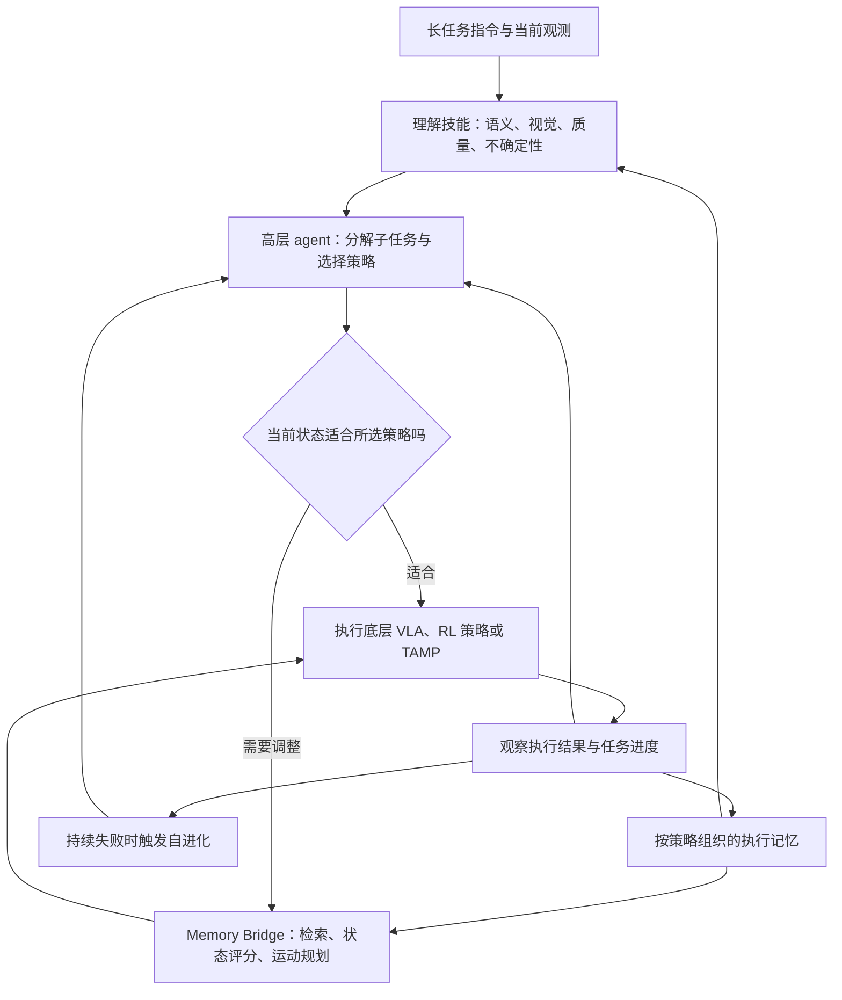

# RoboHarness 精读：异构策略编排与记忆桥

> [!abstract] 核心结论
> RoboHarness 研究如何把已经存在的 VLA、经过 RL 后训练的策略，以及任务与运动规划器组织起来，完成单个策略难以完成的长任务。关键工作包括：根据当前情境选择策略，以及在切换前把机器人带到下一策略有经验处理的状态。
> 对我们最有价值的研究问题是：**一个子任务完成了，是否就意味着下一个策略能够可靠接手？** 论文的 Memory Bridge 专门处理这个缺口，适合启发 LingBot + 规划器或专用 RL 技能的组合研究。

## 1. 论文身份、阅读范围与证据等级

| 项目 | 内容 |
| --- | --- |
| 英文题目 | RoboHarness: Memory-Driven Orchestration of Heterogeneous Robot Policies for Long-Horizon Planning |
| 中文释义 | 面向长时程规划的、由记忆驱动的异构机器人策略编排 |
| 作者 | Jinbang Huang、Yuanzhao Hu、Zhiyuan Li、Ran Qi、Yixin Xiao、Zhanguang Zhang、Mark Coates、Tongtong Cao、Yingxue Zhang |
| 单位 | 华为诺亚方舟实验室、UBC、多伦多大学、麦吉尔大学、华为 2012 实验室相关部门 |
| 阅读版本 | arXiv:2607.18060v2，2026-07-28，21 页、8 幅图 |
| 本地论文 | [[RoboHarness.pdf]] |
| 阅读范围 | 正文第 1–11 页、附录第 16–21 页；核对了方法公式、两张主表和关键图示 |
| 本次核验 | 本地 PDF 正文、附录和图表；arXiv 官方页面的题目、作者和版本日期 |
| 证据边界 | 实验数字均为作者报告，未运行作者代码、重测成功率或验证本机适配 |
| 代码状态 | 本地 PDF 与 arXiv 入口没有提供可直接核验的本项目官方代码链接；本次检索未定位到可确认的官方实现。这不等于证明代码不存在或永久不开源 |

本地文件 SHA-256：`5ba0aaf36ed8e76e7dcc26f5d71308c0d382cb9959eb1df9e4ffa6e00c635cbd`。

官方版本记录见 [arXiv v2 页面](https://arxiv.org/abs/2607.18060v2)。下文页码均指这份本地 PDF；通过 `[[RoboHarness.pdf#page=6]]` 等链接可直接回查。

> [!info] 名称与模型边界
> 本笔记仅讨论上面的题目和 arXiv 编号。文中比较对象 **LingBot-VA** 是另一条模型路线，不能读成我们正在研究的 **LingBot-VLA 2.0**。WAM 出现在对比基线和未来扩展讨论中，论文实际编排的默认策略库是 π0.5、RL 后训练的 OpenVLA-OFT、TAMP。

## 2. 论文要解决什么问题

### 2.1 两种失败需要分别解决

第一种是**选错策略**。一个策略声称会“抓取”，并不意味着它能处理当前对象、语言表达、相机视角或机器人初始姿态。策略能力有情境边界，不能靠固定技能名称完全描述。

第二种是**策略交接失败**。策略 A 成功完成自己的子任务后，留下的机械臂姿态、末端位置或场景可能不符合策略 B 的训练分布。即使 A、B 单独执行都很好，直接串联仍可能失败。

例如“打开抽屉 → 取出积木 → 精确搭桥”：VLA 可能擅长接触复杂的抽屉操作，TAMP 擅长结构化的精确摆放，但开完抽屉后手臂还在柜体附近，下一策略未必能从那里开始。

### 2.2 它处在技术栈的哪一层

| 维度 | 本文实际做法 |
| --- | --- |
| 主要贡献层级 | 已有控制策略上方的高层编排与策略交接 |
| 高层规划器 | 论文使用 Codex + GPT-5.5 的 coding agent |
| 底层策略 | 各自保留原生实现和输入输出 |
| 新增学习模块 | 根据检索到的局部轨迹拟合轻量进度估计器；另有基于经验的系统适配 |
| 是否提出新的 VLA 主干 | 没有 |
| 是否把所有模型端到端联合训练 | 没有；避免联合重训练是设计目标之一 |
| 是否让多个策略每一步同时输出并融合动作 | 论文描述的是子任务选择、执行与交接，没有给出逐步动作融合方案 |

**我的判断：**本文的价值在系统组合与交接机制。它不适合直接作为“某个 6B VLA 的替代基座”来排模型榜，却适合成为同一组基座之上的系统对照。依据：§3–4，[[RoboHarness.pdf#page=3|第 3 页]]。

## 3. 问题定义：拆任务、选策略、安排交接

论文给定策略库 $\Pi=\{\pi_1,\ldots,\pi_N\}$。每个策略有：

- $\mathcal O_i$：在其中能够可靠执行的输入观测范围。
- $\mathcal G_i$：能够完成的子任务范围。
- $\mathcal M_i$：对应执行记忆，问题定义中以成功轨迹为基础。

对一个完整任务，系统需要同时决定子任务序列 $g_1,\ldots,g_T$、每个子任务的策略，以及相邻策略之间的桥接轨迹。当前子任务交给 $\pi_i$，需要同时满足：

$$
g_t\in\mathcal G_i,\qquad o_t\in\mathcal O_i.
$$

这两个条件分别回答“它会不会做这件事”和“它能不能从现在的输入开始做”。真实的能力集合通常未知，论文用记忆、相似度、状态评分和执行结果估计，**不是获得了一个精确可判定的能力边界**。

### “零样本”究竟指什么

§3 的定义是：对未见过的长任务组合，不做针对该组合的底层策略或编排器联合训练。它不要求底层策略没有训练过子技能，也不要求系统完全没有相关记忆。

更关键的是，§4.3 明确写明：**仿真实验启用全部四类自进化机制，在持续失败时触发；验证后的更新跨评测回合保留。** 因而本文的评测包含在线经验积累和适配，不能等同于“冻结系统、每个测试回合从同样的初始记忆独立开始”。依据：[[RoboHarness.pdf#page=3|§3，第 3 页]]、[[RoboHarness.pdf#page=6|§4.3，第 6 页]]。

## 4. 总体架构与一次任务的信息流

这是根据正文整理的信息流示意。论文未提供可直接复用的完整调度伪代码；图中判断不应被理解为已经校准的概率阈值。

> [!example]- 原论文架构图：Figure 1
> ![[RoboHarness.pdf#page=4]]

### 4.1 Understanding Skills：给高层决策提供什么

| 技能 | 实际实现或输入 | 给高层的依据 |
| --- | --- | --- |
| 不确定性评估 | 滑动时间窗内物体位姿的均值与方差 | 估计是否稳定 |
| 视觉上下文 | 冻结的 SigLIP2 与 DINOv2；两者相似度加权 | 当前画面与该策略记忆中的画面是否接近 |
| 语义上下文 | 冻结的 BGE 文本编码器 | 指令与策略历史任务是否相关 |
| 状态兼容性 | 由 Memory Bridge 的局部状态分布与评分提供 | 当前关节配置、末端姿态是否适合接手 |
| 输入质量 | 曝光、过暗/过亮比例、Laplacian 方差、对比度、图像熵等 | 当前图像是否足以支持可靠判断 |

附录给出的编码器是 `google/siglip2-base-patch16-224`、`facebook/dinov2-base`、`BAAI/bge-large-en-v1.5`。这些模块提供相似性或质量指标，论文没有证明它们本身就是校准后的任务成功概率。依据：§4.1、§11.2.1，[[RoboHarness.pdf#page=18|第 18 页]]。

### 4.2 Policy Card：一个策略如何变成可调用技能

策略卡记录类型、能力、接口要求、约束、假设、训练任务与历史执行统计。高层还可以查看实现代码，并随新成功或失败证据更新卡片。

“不用共享动作表示”指各策略不用改成同一个神经网络输出空间；**落地仍要完成接口适配**。尤其 Memory Bridge 需要可比较的机器人状态，执行器也需要清楚地解释各策略的单位、坐标系和目标语义。论文并没有让本体适配工作自动消失。依据：§4.4，第 6–7 页。

## 5. Memory Bridge 逐步精读

### 5.1 记忆不是聊天记录，而是带时间关系的执行轨迹

每条轨迹由时序相连的节点组成。节点包含：任务文本、视觉观测、机器人状态，以及文本和视觉 embedding。附录明确状态包含**关节配置与末端位姿**。

检索得到某个节点后，可以沿时间链找它之前和之后的状态。因此系统不仅知道“以前见过相似场景”，还知道“当时怎样从这里继续执行”。此外还有成功/失败等全局统计；正文以成功轨迹定义策略记忆，后续又描述每次 rollout 更新及失败历史检索，具体存储分区与过滤规则仍需实现澄清。依据：§4.2.1、§11.2.2，[[RoboHarness.pdf#page=19|Figure 7，第 19 页]]。

### 5.2 第一步：先筛语言，再筛图像

在下一策略的相关执行记忆中，先以当前子任务 $g$ 的文本余弦相似度取前 $K_{\text{text}}$ 个节点，再以当前观测 $o$ 的视觉相似度筛出 $K_{\text{vis}}$ 个节点。

直觉是先找到“做相似事情”的片段，再从中找“当前画面相似”的片段。检索单位是轨迹上的节点，节点成为后续展开的锚点，并非简单把一条完整历史轨迹从头重放。

> [!example]- 原论文 Memory Bridge 图：Figure 2
> ![[RoboHarness.pdf#page=5]]

### 5.3 第二步：用锚点前后的轨迹构造进度监督

设第 $i$ 个锚点为 $n_{i,0}$，沿轨迹向前后各取 $l$ 个节点。为这些状态附上时间偏移标签：

$$
(s_{i,j},y_{i,j})=\bigl(s(n_{i,j}),j\Delta t\bigr),\qquad j\in\{-l,\ldots,l\}.
$$

锚点标签为 0，之前为负，之后为正。这些样本用于拟合局部进度函数 $f_{\text{score},t}(s)$。附录说明实际采用 **Pairwise Ranking（SVM）**。

需要区分三个概念：

- 分数描述相对锚点的局部进度，不是任务最终成功率。
- 正分表示预测处在锚点之后，不自动证明当前物体接触关系正确。
- 时间先后被当作进度监督，是一种代理信号；它没有证明实际进度沿每段示范严格单调。

正文用时间偏移分数表述，附录称实际采用成对排序 SVM，但没有完整给出排序样本构造、核函数、正则化和分数零点校准细节。不能补写成“论文训练了一个成功概率网络”。依据：[[RoboHarness.pdf#page=6|§4.2.2，第 6 页]]、[[RoboHarness.pdf#page=19|§11.2.2，第 19 页]]。

### 5.4 第三步：约束分数只能在记忆支持区域内用于选终点

设检索扩展得到的状态集合为 $S_{\text{ret},t}$，论文定义：

$$
\mathcal R_{\text{conf},t}=\left\{s:\min_{\bar s\in S_{\text{ret},t}}\|s-\bar s\|_2\le\epsilon\right\}.
$$

意思是：交接目标不能离历史样本太远，避免评分器在缺乏数据的地方给出不可信高分。

这是经验样本附近的**局部支持区域**，并非带统计覆盖率保证的置信集合。论文还明确允许桥接轨迹经过支持区域之外，只要求有效交接终点满足支持约束。因此不能把它理解为整条路径都受记忆分布约束。

### 5.5 第四步：在可达且有记忆支持的状态中选择交接终点

从当前状态 $s_t$ 选择目标 $s_t^*$：

$$
\begin{aligned}
s_t^*=\arg\max_s\quad &f_{\text{score},t}(s)-\lambda_{\text{motion}}C_{\text{motion}}(s_t,s)\\
\text{s.t.}\quad&s\in\mathcal R_{\text{conf},t}\cap\mathcal S_{\text{plan},t},\\
&f_{\text{score},t}(s)\ge0.
\end{aligned}
$$

| 公式部分 | 直观含义 |
| --- | --- |
| $f_{\text{score},t}(s)$ | 希望接手位置在局部进度上合适 |
| $C_{\text{motion}}$ | 避免为追求分数而移动过远或代价过高 |
| $\mathcal R_{\text{conf},t}$ | 目标附近存在检索到的历史状态支持 |
| $\mathcal S_{\text{plan},t}$ | 所用运动规划器能从当前状态连接到目标 |
| 分数非负 | 目标不能被评分为落在检索锚点之前 |

随后调用现成运动规划器生成到该目标的可行轨迹，再启动下一策略；交接记录也可进入记忆。论文图示提到采样和排序，但候选数量、采样分布及约束无解时的完整回退流程没有充分披露。

**最重要的理解：Memory Bridge 改变的是策略启动时的物理状态。** 它不只是检索文字给 VLM，也不要求联合训练相邻策略，更没有把两个策略权重进行融合。

### 5.6 机制成立的边界

以下是基于公式的分析，属于阅读判断：

1. **机器人姿态相近不等于场景条件相同。** 同样的关节和末端姿态，可能对应空手、持物、物体已滑落等不同状态。视觉检索减少这种歧义，但没有理论上排除它。
2. **混合状态的距离尺度需明确。** 关节角、位置、旋转的单位不同；直接拼接后计算欧氏距离，需要归一化、旋转表示与权重。论文未给出足够细节。
3. **接触与不可逆操作很难靠移臂恢复。** 抽屉没真正打开、双手相互受力或抓持关系改变时，运动到相似姿态不一定恢复下一策略前提。
4. **状态支持区域不保证完成整段任务。** 它是交接选择的经验近似，不是闭环成功性或碰撞安全的形式证明。
5. **经验稀少时桥可能无效。** 对新本体或新技能，需要先获得相关执行记录；这也是作者明确承认的局限。

## 6. Self-Evolution：具体在“进化”什么

| 类型 | 论文实际描述 | 不应扩展成的结论 |
| --- | --- | --- |
| 策略适配 | 用 SIMPACT 调整 TAMP 抓取等运动参数，用 PDDLLM 扩展符号表示 | 不能据此说在线重训练了 π0.5 或 LingBot 权重 |
| 编排器改进 | coding agent 根据运行错误与执行记录修复接口、调整路由和协调代码 | 不能视为固定、完全不变的测试策略 |
| 参数调整 | 连续参数离散为搜索网格，agent 选择增加、减少或保持，由模块映射成数值 | 不是推导出一个全局最优控制器 |
| 元数据更新 | 记录哪些对象、场景、任务条件下成功或失败 | 经验统计不自动等于校准的能力模型 |

仿真中四类机制全部启用，持续失败才触发，验证后跨回合保留。论文没有充分给出失败触发次数、调整总预算、回合顺序、重置策略，以及真机是否采用同等的在线代码更新协议。

因此复现时要分别测“固定策略与编排、冻结记忆”和“允许记忆与系统跨回合适配”。两种协议回答不同问题。依据：§4.3、§11.2.3，第 6、19–20 页。

## 7. 默认设置：数据、输入输出、训练与推理

| 常见问题 | 这篇论文能支持的回答 |
| --- | --- |
| 使用什么训练数据格式 | 没有提出统一的 VLA 训练数据格式；各策略沿用自己的数据和实现。记忆采用链接的轨迹节点，论文没有给出可直接导入的标准磁盘 schema |
| 默认策略有哪些 | 仿真为 π0.5、GRPO 后训练的 OpenVLA-OFT、TAMP；路由分析和真机有明确缩减配置 |
| π0.5 从哪里来 | 官方 `pi05_libero`，已在 LIBERO Spatial/Goal/Long/Object 上微调 |
| RL 策略是什么 | `RLinf/RLinf-OpenVLAOFT-GRPO-LIBERO-90`；在 LIBERO-90 的 90 个短任务上做 GRPO 后训练 |
| TAMP 如何实现 | PDDL 表示任务，FF 规划器和 PDDLStream 的 Python 接口连接连续抓取、放置、机器人配置采样 |
| 高层输入 | 长任务语言、图像、估计物体位姿、机器人状态、执行反馈和记忆 |
| 高层输出 | 子任务、策略分配与交接决策；低层动作仍由各策略输出 |
| 预测关节角还是末端位姿 | 没有统一规定；各策略保留原生动作接口。记忆同时存关节配置和末端位姿，不代表所有策略同时预测二者 |
| 全量微调还是专家微调 | 不是本文统一定义的训练设置。真机 π0.5 有技能微调，但未披露足够的冻结范围、优化器和 batch 等配置 |
| 是否联合训练所有策略 | 不要求。局部进度估计器会拟合，系统还会基于经验调整 |
| 真机 VLA 训练量 | 开抽屉与关抽屉各 50 条人工示范，共 100 条；初始化为 `pi05_libero` |
| 语言如何使用 | 高层显式解释长任务并拆成子任务，再为底层策略提供其接口需要的信息；本文没有重新设计底层 VLA 的 tokenizer 或语言主干 |
| 推理同步还是异步 | 可以确认“规划、执行、反馈、交接”的阶段关系；未披露通信与线程协议、动作队列、控制频率、RTC 或延迟，不能断言底层全程同步或异步 |
| 是否用世界模型预测未来再规划 | 默认实现没有这一要求；WAM 是对比和未来扩展方向 |
| 是否已经接入 RoboTwin / RM65-B / LingBot-VLA 2.0 | 本文没有提供这三者的适配或评测证据 |

依据：§5、§11.1.2、§11.2.4，第 7–8、17–18、20–21 页。模型标识在此按论文记录，不代表本次下载或测试过对应权重。

## 8. 实验结果：什么证据支持什么结论

### 8.1 LIBERO 原始任务与 LIBERO-Plus 扰动

原始 LIBERO 成功率：RoboHarness **98.7%**，π0.5 **96.9%**，OpenVLA-OFT **97.6%**。提升分别为 **1.8、1.1 个百分点**。这是系统结果与单策略结果的比较，不是“同一个模型只改了记忆模块”的消融。

从 Table 1 的分类数字看，RoboHarness 在七类扰动中六类最高；传感器噪声一项为 90.3%，低于 Cosmos-Policy 的 92.7%。与 π0.5 相比：

| 扰动 | RoboHarness | π0.5 | 提升，百分点 |
| --- | ---: | ---: | ---: |
| 机器人状态 | 90.4 | 75.4 | 15.0 |
| 语言 | 97.0 | 85.6 | 11.4 |
| 相机 | 87.6 | 75.4 | 12.2 |
| 传感器噪声 | 90.3 | 89.7 | 0.6 |

这些结果与“按情境选策略、修复初始状态”的思路一致，但分类总结果不能单独隔离 Memory Bridge 的因果贡献。依据：[[RoboHarness.pdf#page=7|Table 1，第 7 页]]。

> [!warning] Table 1 的 Average 列需要核实
> 原表报告 RoboHarness 平均 93.2%，但七类扰动分数的简单平均约为 **92.37%**；π0.5 为约 **86.19%**，原表写 85.7%。仅凭这两行不能排除使用了不同权重。
> 更明显的是 π0 一行：七类分数的简单平均约 **72.29%**，原表却写 **53.6%**，低于所列七类分数的最小值 **61.0%**，因此它不可能是这些列的普通非负加权平均。论文没有交代能解释该差异的另一种聚合口径。
> 本笔记保留原表报告，不把复算值冒充修正版官方结果，也不采用这列进行可靠总排名。该问题已对照 PDF 页面确认，不只是文本抽取错误。

### 8.2 LIBERO-LoHo：长任务结果最突出

论文称其平均时程约为原 LIBERO 的四倍。Table 2 给出五项任务的结果：

| 方法 | 平均进度分数 % | 平均成功率 % |
| --- | ---: | ---: |
| RoboHarness | 97.5 | 95.2 |
| H-WM-π0.5 | 84.9 | 64.8 |
| Logic-guided π0.5 | 73.2 | 48.4 |
| LLM-guided π0.5 | 66.8 | 26.8 |
| π0.5 | 55.3 | 6.4 |

RoboHarness 相对 H-WM-π0.5 的成功率高 **30.4 个百分点**，相对单独 π0.5 高 **88.8 个百分点**。单策略仍有非零进度，但常不能完成整条链，说明只看平均子任务推进程度容易高估长任务可靠性。

**阅读边界：**比较同时改变了策略库、编排、记忆和适配能力；§5.2 还说明基线结果取自已有基准评测文献。不能把全部差距归因于 Memory Bridge，也不能默认所有数字由作者在同一计算预算下统一重测。依据：[[RoboHarness.pdf#page=8|Table 2 与 §5.2，第 8 页]]。

### 8.3 500 个自定义任务：消融比总榜更能说明机制

10 类任务，每类 50 个随机桌面初态，专门设计为需要多策略配合。包括抽屉开关、容器内放置、物体收集、堆叠、灶台操作、左右/中间对象指代等。任务类别详情见 [[RoboHarness.pdf#page=16|附录 §11.1.1]]。

Figure 4 的逐柱读数如下：

| 系统 | 成功率 % | 进度分数 % | 相对完整系统的成功率下降 |
| --- | ---: | ---: | ---: |
| 完整 RoboHarness | 86.0 | 93.1 | — |
| 无 Memory Bridge | 60.4 | 82.9 | 25.6 个百分点 |
| 无 Evolution | 54.6 | 74.9 | 31.4 个百分点 |
| 无 Understanding | 37.6 | 68.7 | 48.4 个百分点 |
| Motion Planner | 36.4 | 71.8 | 49.6 个百分点 |
| RL-OpenVLA | 0.0 | 28.5 | 86.0 个百分点 |
| π0.5 | 0.0 | 4.6 | 86.0 个百分点 |

可以得出的结论：

- 去掉理解技能损失最大，说明场景解释、任务分解与策略指派是整个系统的重要前提。
- 去掉 Memory Bridge 后，进度仍有 82.9%，完整成功却降至 60.4%；这直接支持“能选对策略不等于能把整条链接起来”。
- 去掉 Evolution 损失也很大，强调线上适配是实际系统的重要组成，不能在介绍方法时忽略它。

不能得出的结论：各模块贡献可线性相加、这些差值适用于任意任务、桥接是所有提升的唯一原因。任务本来就是为多策略必要性设计的，必须同时看公共基准和独立任务上的效果。依据：[[RoboHarness.pdf#page=10|Figure 4，第 10 页]]。

> [!example]- 原论文消融图与真机实验说明
> ![[RoboHarness.pdf#page=10]]

### 8.4 路由是否有依据

Figure 3 的专项实验仅使用 **π0.5 + TAMP**，用于减少任务覆盖差异对策略调用比例的影响。VLA 调用比例在光照扰动下为 93.7%，背景为 90.0%，机器人状态为 46.2%，传感器噪声为 37.4%。

大体上 VLA 更可靠的情境调用更多，但传感器噪声是明显例外。图中只有按扰动类型聚合的关联，不能证明每一次选择最优，也没有给出针对每个状态的成功概率校准或 oracle 路由上界。依据：[[RoboHarness.pdf#page=9|Figure 3，第 9 页]]。

### 8.5 真机：UR5e，135 次试验

真机采用 **UR5e + π0.5 + TAMP**，物体位姿估计使用 **ArUco 标记**，TAMP 通过 PDDLStream 和机器人底层 API 执行。VLA 负责抽屉接触操作，TAMP 负责积木取放与结构构建。Figure 6 明确标出 TAMP 取出缺失积木，因此不宜把“找出并取回所有积木”都算成 VLA 单独完成。

135 次的组成是 **5 种目标结构 × 15 次 + 4 种扰动设置 × 15 次**，并不是五种结构与四种扰动全组合。每次构建初始随机有 1–3 块必要积木藏在柜体里；额外扰动实验以 Bridge 任务为基础。

| 设置 | 成功率 % | 每项试验数 |
| --- | ---: | ---: |
| Bridge | 86.7 | 15 |
| Taller Bridge | 66.7 | 15 |
| Tower | 93.3 | 15 |
| Chinese Character | 80.0 | 15 |
| Boat | 86.7 | 15 |
| 执行中再次藏起积木 | 66.7 | 15 |
| 拆散已经搭好的部分 | 80.0 | 15 |
| 增加干扰积木 | 86.7 | 15 |
| 位姿估计加入 5%–10% 相对噪声 | 73.3 | 15 |

**证据意义：**表明这种高层组织与状态恢复机制可以进入实际物理闭环。**适用边界：**每项仅 15 次，一次成败就影响约 6.7 个百分点；有标记定位、预定义积木和单臂操作条件，不能直接证明任意对象、双臂灵巧手或 RM65-B 的效果。论文没有给出同设置的完整真机模块消融和不确定性区间。

来源：[[RoboHarness.pdf#page=11|Figure 5，第 11 页]]、[[RoboHarness.pdf#page=17|Figure 6，第 17 页]]、[[RoboHarness.pdf#page=18|真机实现，第 18 页]]。

## 9. 这篇论文哪里强，哪里仍需验证

### 值得借鉴的部分

1. 将**能力判断**与**交接可行性**一起纳入长任务规划，比只生成文本子任务序列更接近实际机器人问题。
2. 记忆保留时序链接，使检索结果能用于物理状态恢复，而不局限于给语言模型提供背景材料。
3. 通过外部桥接复用独立策略，允许保留各策略原生接口，适合已有模型和技能资产较多的实验平台。
4. 同时报告进度和整任务成功率，并在消融中显现两者差距，能帮助发现“看起来做了很多，但总是差最后一步”的问题。

### 影响结论和复现的缺口

| 问题 | 为什么重要 | 需要补充的证据 |
| --- | --- | --- |
| Table 1 聚合数字异常 | 直接影响平均鲁棒性结论和总排名 | 原始分类计数、平均公式或修订表 |
| 记忆和在线更新跨回合保留 | 结果可能依赖评测顺序、经验积累和试错预算 | 初始记忆、回合顺序、更新日志、独立回合对照 |
| 记忆初始化与数据隔离不充分 | 无法判断开始测试前已有哪些经验 | 轨迹来源、数量、训练/验证/测试划分、失败数据使用规则 |
| 策略库与基线不完全等价 | 增加技能覆盖本身就可能提升成功率 | 固定同一策略库比较静态路由、随机路由、上下文路由和 oracle |
| 缺少交接专属的细分实验 | 无法确定改善来自检索、进度估计还是简单移臂 | 最近邻目标、固定中立姿态、无进度评分、完整桥接的对照 |
| 超参数与运行预算不足 | 无法估计部署成本，也难做到一致复现 | 检索 K、展开窗口、距离尺度、SVM 配置、规划时间、调用次数与 GPU/API 成本 |
| 完整高层协议未披露 | 高层 agent 的提示、工具权限和停止条件也会影响成功率 | 固定版本代码、完整提示模板、成功判定与失败回退流程 |
| 本体迁移证据有限 | 双臂协作、灵巧手接触增加新状态和约束 | 本体专属状态表示、记忆、交接试验和统计 |

这些是“当前证据还回答不了的问题”，不是已经证明方法失效。作者在 §9 也承认策略库能力上限、记忆稀疏和经验不足的限制。

## 10. 对 LingBot、RoboTwin 与 RM65-B 的启发

本节是面向我们项目的推导和实验建议，**不属于论文已完成的实验**。硬件依据来自 [[RM65-B双臂机器人]]：双臂每臂 6 轴、双灵巧手、头部与双腕共三台 D435；手部具体控制自由度仍以硬件卡的待核验状态为准。

### 10.1 LingBot 可以承担底层策略角色

我们已研究的 LingBot 默认流程侧重语言条件下的动作块生成；本论文把长任务分解与调度放到外部高层。可研究“LingBot 完成语义与接触技能，规划器完成可建模的几何移动或交接”，随后再加入确有互补优势的 RL 技能。

这不会自动改变 LingBot 的主干、数据格式或动作表示。首先需要任务、本体和输入输出约定匹配，不能直接把 LIBERO 或 UR5e 的策略与轨迹拿来控制 RM65-B。对照笔记：[[RoboTwin与LingBot-VLA默认流程对照]]、[[LingBot-VLA2与π0、SmolVLA架构比较]]。

### 10.2 Memory Bridge 值得从双臂交接状态入手

若在本机设计桥接状态，至少需要考虑双臂关节、双手实际可控状态、末端位姿和对象/抓持关系。对于双臂协作，仅把左右末端距离历史位置很近作为交接条件可能不足。

第一步可以在仿真中固定技能库，制造“下一技能开始时的姿态偏差”，比较直接启动与桥接后启动。这样能单独检验交接问题，不必一开始引入完整在线自改代码和全部三类底层策略。

### 10.3 与语言约束研究的连接

论文评估语言扰动和任务指代，但没有提供任意自然语言禁令或时序约束的形式保证。我们可以进一步问：**桥接提高了下一技能的可执行性，会不会同时破坏原任务约束？**

例如“保持左手托住容器，右手把物体放入，期间不得倾斜容器”：一个单纯追求历史进度分数的桥接动作可能改变左手支撑关系。因此值得把约束分成可观察的条件，并在选策略、选交接目标与执行过程中都检查。

一个可检验的研究假设是：在相同技能库和记忆预算下，加入任务约束的交接选择，可以降低约束违反率，同时维持较高的长任务成功率。这个方向超出了本文现有实验，需要独立设计和验证。

### 10.4 与 VLA + RL 的关系

本文的 RL 部分是**接入已经经过 GRPO 训练的独立策略**。它没有把高层编排和全部底层 VLA 一起做 RL，也没有训练一个通用 RL Memory Bridge。

对我们的路线，先用非学习式规划桥接检验问题是否成立；若特定接触恢复无法由运动规划处理，再研究是否值得用 RL 学习该恢复技能。这样可以分别回答“需要桥接吗”和“桥接本身需要 RL 吗”。

## 11. 建议的最小实验设计

这是一份待执行计划，当前没有创建训练作业或改动服务器。

### 实验问题

同样的两个底层技能，为什么独立成功率高、串联成功率低？记忆支持的状态调整是否能提高交接后的条件成功率？

### 对照组

| 组别 | 路由和交接方式 | 用来隔离什么 |
| --- | --- | --- |
| A | 固定正确子任务顺序，直接切换 | 无桥接的基本表现 |
| B | 相同顺序，回到预定义中立姿态 | 简单恢复姿态是否已经足够 |
| C | 相同顺序，检索最近的历史可达状态 | 检索本身的价值 |
| D | 相同顺序，局部支持约束 + 进度评分 + 运动代价 | Memory Bridge 机制的增益 |
| E | 在 D 上加入语言/任务约束检查 | 我们拟研究的约束机制是否有效 |

先固定顺序是为了隔离桥接作用；桥接有稳定收益后，再比较静态路由和能力感知路由。

### 数据与评测约定

- 记忆只由独立训练或采集集合构建，测试初态与相关轨迹分开；先固定记忆和配置完成主对照。
- 各组使用相同任务、初态、技能 checkpoint、重试次数和执行时间预算。
- 再单独增加跨回合记忆更新实验，明确报告回合顺序和更新次数。
- 记录每次交接前状态、检索节点、目标状态、轨迹、耗时，以及下一策略是否成功；失败要区分规划失败、交接失败、技能失败和约束违反。

核心指标包括整任务成功率、交接后下一技能的条件成功率、进度分数、约束违反率、桥接时长、完整任务耗时和高层调用成本。可额外记录目标到记忆样本的距离，但距离改善本身不能代替执行成功证据。

若沿用 RoboTwin 做自定义长任务，需要单独报告任务构造与评测协议；结果不能直接标成官方 RoboTwin 榜单成绩。关联：[[RoboTwin 2.0框架与默认任务]]、[[具身模型训练与仿真实验平台选型]]。

## 12. 复述与组会讨论用的五个问题

1. **为什么子任务规划正确仍会失败？** 因为上一策略留下的终态可能不满足下一策略的启动分布和物理前提。
2. **Memory Bridge 为什么需要时间链接？** 检索到相似节点后，要利用它前后的状态构造局部进度方向。
3. **评分高是否意味着成功概率高？** 不能；评分代理的是局部时间进度，记忆支持与规划可达只是额外约束。
4. **这篇论文是否完全不训练、不适配？** 不是；底层技能已有训练，真机 VLA 有微调，局部估计器会拟合，仿真系统还保留跨回合适配。
5. **我们最值得复用什么？** 显式记录并验证策略交接状态，把语言约束与“下一策略能够接手”同时作为实验对象。

## 13. 原文定位与后续问题

| 查什么 | 原文入口 |
| --- | --- |
| 零样本定义、任务/策略/桥接三者关系 | [[RoboHarness.pdf#page=3\|§3，第 3 页]] |
| 总架构与理解技能 | [[RoboHarness.pdf#page=4\|Figure 1、§4.1，第 4 页]] |
| 检索过程 | [[RoboHarness.pdf#page=5\|Figure 2、§4.2.1，第 5 页]] |
| 支持区域、目标优化、自进化 | [[RoboHarness.pdf#page=6\|§4.2.2–4.3，第 6 页]] |
| LIBERO/Plus 与 LoHo 结果 | [[RoboHarness.pdf#page=7\|Table 1]]、[[RoboHarness.pdf#page=8\|Table 2]] |
| 路由分析、组件消融 | [[RoboHarness.pdf#page=9\|Figure 3]]、[[RoboHarness.pdf#page=10\|Figure 4]] |
| 真机统计与执行流程 | [[RoboHarness.pdf#page=11\|Figure 5]]、[[RoboHarness.pdf#page=17\|Figure 6]] |
| 仿真任务类别 | [[RoboHarness.pdf#page=16\|§11.1.1]] |
| 真机实现与编码器 | [[RoboHarness.pdf#page=18\|§11.1.2–11.2.1]] |
| 记忆结构、SVM、自进化细节 | [[RoboHarness.pdf#page=19\|§11.2.2–11.2.3]] |
| 原始模型标识与 TAMP | [[RoboHarness.pdf#page=20\|§11.2.4，第 20–21 页]] |

- [ ] 查到作者可核验实现后，确认检索参数、状态归一化、SVM 与桥接失败回退。
- [ ] 核实 Table 1 的聚合数字，以及系统记忆与在线更新的评测协议。
- [ ] 在现有仿真任务中选择一条确有交接失败的短链，执行固定技能库对照。
- [ ] 判断语言约束是否带来普通记忆桥不能解决的失败，再决定是否扩展为独立研究问题。

关联：[[LingBot-VLA 2.0项目概述]] · [[RoboTwin与LingBot-VLA默认流程对照]] · [[RM65-B双灵巧手：LingBot-VLA2选型与适配路线]] · [[RM65-B双臂机器人]]。
